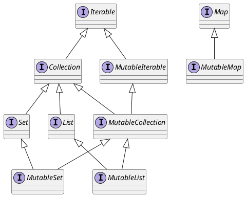
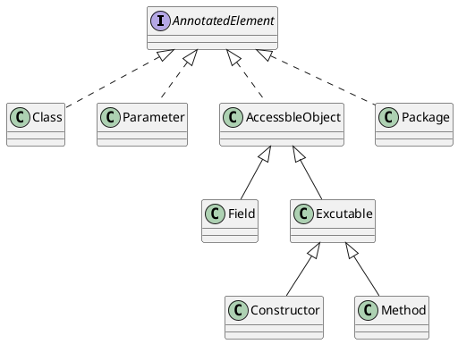
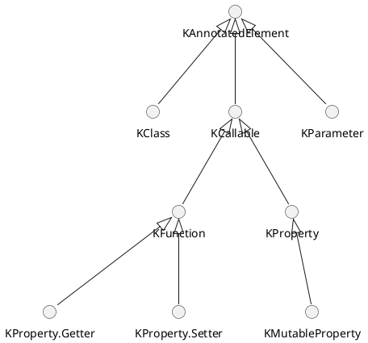

<!-- TOC -->

- [kotlin基础](#kotlin基础)
  - [变量](#变量)
  - [函数](#函数)
    - [函数基础](#函数基础)
    - [函数参数化](#函数参数化)
  - [面向表达式编程](#面向表达式编程)
    - [表达式语句](#表达式语句)
    - [枚举类](#枚举类)
    - [when](#when)
    - [区间表达式](#区间表达式)
    - [infix表达式](#infix表达式)
  - [字符串](#字符串)
- [面向对象](#面向对象)
  - [类和对象](#类和对象)
  - [构造方法](#构造方法)
    - [构造方法](#构造方法-1)
    - [延迟初始化](#延迟初始化)
    - [主从构造方法](#主从构造方法)
  - [访问控制](#访问控制)
  - [继承](#继承)
  - [数据类](#数据类)
  - [object](#object)
    - [伴生对象](#伴生对象)
    - [object单例](#object单例)
    - [object表达式](#object表达式)
- [代数数据类型和模式匹配](#代数数据类型和模式匹配)
  - [积类型和和类型](#积类型和和类型)
  - [模式匹配](#模式匹配)
  - [增强Kotlin的模式匹配](#增强kotlin的模式匹配)
    - [类型测试/类型转换](#类型测试类型转换)
    - [面向对象的分解](#面向对象的分解)
    - [访问者设计模式](#访问者设计模式)
- [类型系统](#类型系统)
  - [可空类型](#可空类型)
  - [类型转换](#类型转换)
  - [特殊的类型](#特殊的类型)
  - [泛型](#泛型)
  - [类型擦除](#类型擦除)
  - [协变与逆变](#协变与逆变)
- [Lambda和集合](#lambda和集合)
  - [Lambda简化表达](#lambda简化表达)
  - [集合的高阶函数API](#集合的高阶函数api)
  - [集合库的设计](#集合库的设计)
  - [惰性集合](#惰性集合)
  - [内联函数](#内联函数)
- [多态和扩展](#多态和扩展)
  - [扩展](#扩展)
  - [标准库的扩展函数](#标准库的扩展函数)
  - [正确使用扩展](#正确使用扩展)
- [元编程](#元编程)
  - [反射](#反射)
    - [待补全](#待补全)
  - [注解](#注解)
    - [待补全](#待补全-1)
- [设计模式](#设计模式)
  - [创建型模式](#创建型模式)
    - [伴生对象增强工厂模式](#伴生对象增强工厂模式)
    - [内联函数简化抽象工厂](#内联函数简化抽象工厂)
    - [使用具名可选参数而不是构建者模式](#使用具名可选参数而不是构建者模式)
  - [行为型模式](#行为型模式)
    - [观察者模式](#观察者模式)
    - [高阶函数简化策略模式、模板方法模式](#高阶函数简化策略模式模板方法模式)
    - [运算符重载和迭代器模式](#运算符重载和迭代器模式)
    - [用偏函数实现责任链模式](#用偏函数实现责任链模式)

<!-- /TOC -->

[>_<]:《Kotlin核心编程》

## kotlin基础

### 变量

变量使用`var`声明，变量会自动进行类型推断，也可使用冒号显示声明变量类型。常量使用`val`声明。

常见数据类型包括：
- Byte
- Short
- Int
- Long
- Float
- Double
- String
```kotlin
var intNum = 3;
var byteNum:Byte = 3;
val PI = 3.1415926;
```

`val`指的是varible+final，即引用不可变。但声明和初始化赋值可以分离。

```kotlin
val l = intArrayOf(1, 2, 3);
l[0] = 2;
```

```kotlin
val a: Int;
a = 1;
```

应当**优先使用`val`、不可变对象及纯函数来设计程序**。

### 函数

#### 函数基础

```kotlin
fun main(args: Array<String>) {
    println("Hello World!")
}
```

`fun`声明函数，`main()`函数是程序的入口。

```kotlin
fun 函数名(参数名:参数类型):返回类型{
    函数体
}
```

表达式作为函数体，返回类型自动推断（在没有递归的情形），当然也可以显式声明：

```kotlin
fun add(a: Int, b: Int) = a + b
```

无返回值使用`Unit`。没有声明返回类型的函数会被当做无返回值。

```
fun sayHello(name:String):Unit{
    println("大家好我叫${name}");
}
```

#### 函数参数化

函数类型由`()->`引导，括号内为参数类型，箭头后为返回值类型。不能省略Unit。

使用函数作为参数：

```kotlin
fun filterStudent(students: List<Student>, assertion:(Student)->Boolean):List<Student>{
    val res = mutableListOf<Student>()
    for (s in students){
        if (assertion(s)) {
            res.add(s)
        }
    }
    return res
}
```

可以使用匿名函数：

```kotlin
filterStudent(students, fun(student: Student): Boolean { return student.age == 100 })
```

lambda表达式由{}包裹，由->引导返回值。在指定lambda表达式类型时可以忽略函数内变量的类型声明；在声明函数内变量类型后可以自动推导lambda表达式类型。

函数只有花括号时，是代码块函数体，如果有返回值必须带`return`。

```kotlin
fun fun1(x: Int) { print(x) }
fun fun2(x:Int, y:Int): Int { return x + y }
```

当没有等号也没有花括号时，是单表达式函数体，可以省略`return`。

```kotlin
fun fun3(x:Int, y:Int) = x + y
```

`= { ... }`形式是lambda表达式，参数在lambda表达式内部声明。所以如果前用`fun`声明，得到的就是lambda表达式函数体，必须用`invoke()`或`()`来调用。

```kotlin
val fun4 = { x: Int, y: Int -> x + y } // fun4(1, 2)
fun fun5(x: Int) = { y: Int -> x + y } // fun5(1)(2)
```

因为fun5其实相当于返回lambda表达式：

```kotlin
fun fun5(x: Int): (Int) -> (Int) {
    return { y: Int -> x + y }
}
```

```kotlin
fun foo(x: Int) = { print(x) }
fun bar(x: Int) = run { print(x) }
listOf(1, 2, 3).forEach { foo(it)() }
listOf(1, 2, 3).forEach { bar(it) }
```

当函数的最后一个参数是函数时，调用时可以将{}放在大括号外。如果仅有一个参数且为函数，调用时可以省略括号。

### 面向表达式编程

#### 表达式语句

简略来说，表达式是有返回值的语句。在Kotlin中，if、try/catch/finally、函数体、lambda等都是表达式。

语句的作用就是服务于创建副作用（修改外部变量）的，而原则上的函数式编程，表达式不允许包含副作用。

Unit类型用以替代Java中的void，返回Unit类型表示没有返回值，让函数调用皆为表达式。

#### 枚举类

```kotlin
enum class Day {
    MON,
    TUE,
    WEN,
    THU,
    FRI,
    SAT,
    SUN
}
```

注意在枚举属性和枚举方法之间必须要有一个分号来区分。

```kotlin
enum class DayOfWeek(val day: Int) {
    MON(1),
    TUE(2),
    WEN(3),
    THU(4),
    FRI(5),
    SAT(6),
    SUN(7)
    ;

    fun getDayNumber(): Int {
        return day
    }
}
```

#### when

```kotlin
fun schedule(sunny: Boolean, day: Day): String = when (day) {
    Day.SAT -> "play game"
    Day.SUN -> "finshing"
    else -> when {
        sunny -> "outdoor"
        else -> "study"
    }
}
```

如果没有声明when所判断的对象，when会以->左侧的逻辑值来进行选择。

```kotlin
fun schedule(sunny: Boolean, day: Day): String = when {
    day == Day.SAT -> "play game"
    day == Day.SUN -> "finshing"
    sunny -> "outdoor"
    else -> "study"
}
```

#### 区间表达式

区间表达式的用法：

```kotlin
for (i in 1..10) {
    println(i)
}
```

包含首尾两端。

#### infix表达式

infix表达式是类似于运算符的函数调用，也可以像普通函数一样调用：

```kotlin
class Person {
    infix fun called(name: String) {
        println("My name is ${name}.")
    }
}

fun main(args: Array<String>) {
    val p = Person()
    p called "Steve"
}
```

map常用如下定义：

```kotlin
mapOf(
    1 to "one",
    2 to "two",
    3 to "three"
)
```

```kotlin
public infix fun <A, B> A.to(that: B): Pair<A, B> = Pair(this, that)
```

### 字符串

字符串是不可变对象。生字符串使用三引号来引导。

字符串模板用$引导。

```kotlin
fun sayHello(name:String):String{
    return "大家好我叫${name}";
}
```

## 面向对象

### 类和对象

```kotlin
class Student {
    val name: String = "Steve"
    val age: Int = 13
    fun run() {}
}
```

Kotlin中的类，除非显式声明延迟初始化，否则必须指定默认值。

```kotlin
interface flyable {
    val speed: Int
    fun fly() {
        println("I can fly.")
    }
}
```

Kotlin的接口通过方法来实现属性，所以不支持直接赋值常量，需要用`get()`。

```kotlin
interface Flyable {
    val height
        get() = 1000
}
```

### 构造方法

#### 构造方法

支持构造方法默认参数，来减少Java中的构造函数重载带来的麻烦。

```kotlin
class Bird(val age: Int = 1, val color: String = "blue")
```

```kotlin
val bird = Bird(color = "black")
```

构造方法参数名前的`val`和`var`其实表示在类内创建同名属性。

构造方法的参数只能在初始化类内属性成员或init语句块中调用。可以有多个init语句块，它们将会由上而下执行。

```kotlin
class Bird(maybeWeight: Int, val color: String) {
    val weight: Int = if (maybeWeight > 0) maybeWeight else 0

    init {
        println("do some other thing")
        println("the weight is ${maybeWeight}")
    }

    // Unresolved reference: maybeWeight
    // fun printWeight() {
    //     println(maybeWeight)
    // }
}
```

#### 延迟初始化

类内属性必须立即初始化，除非显式延迟初始化。

```kotlin
class Person(val name: String, val age: Int) {
    val isAdult: Boolean by lazy(LazyThreadSafetyMode.NONE) { age >= 18 }
}
```

`lazy`接受其后的lambda，返回一个`Lazy<T>`。第一次访问属性时执行lambda并记录结果，以后只是返回记录的结果。因此，`by lazy`只用于常量，赋值后不再更改。

`lazy`默认有同步锁(`LazyThreadSafetyMode.SYNCHRONIZED`)，并行模式`(LazyThreadSafetyMode.PUBLICATION`，`LazyThreadSafetyMode.NONE`将不会有任何线程开销。

`var`应该使用`lateinit`。

```kotlin
class Person(val name: String, val age: Int) {
    lateinit var sex: String

    fun printSex() {
        this.sex = if (this.name == "Steve") "male" else "female"
        println(this.sex)
    }
}
```

#### 主从构造方法

从构造方法通过`constructor`定义，用于接收特殊的数据来获取构造类的参数值。每个类可以有一个主构造方法和多个从构造方法，从构造方法直接或间接地委托主构造方法。

```kotlin
class Bird(age: Int) {
    val age: Int

    init {
        this.age = age
    }

    constructor(birth: DateTime) : this(getAgeByBirth(birth))
    constructor(timestamp: Long) : this(DateTime(timestamp))
}

fun getAgeByBirth(birth: DateTime): Int {
    return Years.yearsBetween(birth, DateTime.now()).years
}
```

### 访问控制

Kotlin默认类不允许继承，方法不允许重写，即`final`，需要用`open`允许继承。

密封类（`sealed`）只允许在本文件继承，不能初始化，因为内部实现是一个抽象类。

```kotlin
sealed class Bird {
    open fun fly() = "I can fly"
    class Eagle : Bird()
}
```

Kotlin默认类是`public`的。`protected`表示类及子类内可见；`private`在类内表示本类可见，在类外表示本文件可见；`internal`表示模块内可见。一个模块表示一起编译的Kotlin文件。

### 继承

Kotlin使用单冒号来继承。Kotlin只支持单继承。

多继承接口时，必须使用`override`实现接口属性和方法，可以用`super<T>`调用接口的默认方法。

```kotlin
interface Flyable{
    fun fly()
    fun kind() = "flyable"
}

interface Runable{
    fun run()
    fun kind() = "runable"
}

class Bird(val name:String):Flyable , Runable{
    override fun fly() {
        println("bird can fly")
    }

    override fun run() {
        println("bird can run")
    }

    override fun kind(): String {
        return super<Flyable>.kind()
    }
}
```

使用`inner`声明内部类，使用内部类来解决多继承问题：

```kotlin
open class Horse {
    fun runFast() {
        println("I can run fast")
    }
}

open class Donkey {
    fun doLongTimeThing() {
        println("I can do some thing long time")
    }
}

class Mule {
    private inner class HorseC : Horse()
    private inner class DonkeyC : Donkey()

    fun runFast() {
        HorseC().runFast()
    }

    fun doLongTimeThing() {
        DonkeyC().doLongTimeThing()
    }
}
```

`by`用于委托，可以替代多继承。

```kotlin
interface Flyable {
    fun fly()
}

interface Runable {
    fun run()
}

class Flyer : Flyable {
    override fun fly() {
        println("I can fly")
    }
}

class Runer : Runable {
    override fun run() {
        println("I can run")
    }
}

class Bird(flyer: Flyer, runer: Runer) : Flyable by flyer, Runable by runer {}

fun main(args: Array<String>) {
    val flyer = Flyer()
    val runer = Runer()
    val bird = Bird(flyer, runer)
    bird.fly()
    bird.run()
}
```

### 数据类

用`data class`声明数据类，Kotlin会自动生成getter/setter，equals、hashCode、构造方法等函数。

```kotlin
data class Bird(var weight: Double, var age: Int, var color: String)
```

反编译如下：

```java
public final class Bird {
   private double weight;
   private int age;
   @NotNull
   private String color;

   public final double getWeight() {
      return this.weight;
   }

   public final void setWeight(double var1) {
      this.weight = var1;
   }

   public final int getAge() {
      return this.age;
   }

   public final void setAge(int var1) {
      this.age = var1;
   }

   @NotNull
   public final String getColor() {
      return this.color;
   }

   public final void setColor(@NotNull String var1) {
      Intrinsics.checkNotNullParameter(var1, "<set-?>");
      this.color = var1;
   }

   public Bird(double weight, int age, @NotNull String color) {
      Intrinsics.checkNotNullParameter(color, "color");
      super();
      this.weight = weight;
      this.age = age;
      this.color = color;
   }

   public final double component1() {
      return this.weight;
   }

   public final int component2() {
      return this.age;
   }

   @NotNull
   public final String component3() {
      return this.color;
   }

   @NotNull
   public final Bird copy(double weight, int age, @NotNull String color) {
      Intrinsics.checkNotNullParameter(color, "color");
      return new Bird(weight, age, color);
   }

   // $FF: synthetic method
   public static Bird copy$default(Bird var0, double var1, int var3, String var4, int var5, Object var6) {
      if ((var5 & 1) != 0) {
         var1 = var0.weight;
      }

      if ((var5 & 2) != 0) {
         var3 = var0.age;
      }

      if ((var5 & 4) != 0) {
         var4 = var0.color;
      }

      return var0.copy(var1, var3, var4);
   }

   @NotNull
   public String toString() {
      return "Bird(weight=" + this.weight + ", age=" + this.age + ", color=" + this.color + ")";
   }

   public int hashCode() {
      long var10000 = Double.doubleToLongBits(this.weight);
      int var1 = ((int)(var10000 ^ var10000 >>> 32) * 31 + this.age) * 31;
      String var10001 = this.color;
      return var1 + (var10001 != null ? var10001.hashCode() : 0);
   }

   public boolean equals(@Nullable Object var1) {
      if (this != var1) {
         if (var1 instanceof Bird) {
            Bird var2 = (Bird)var1;
            if (Double.compare(this.weight, var2.weight) == 0 && this.age == var2.age && Intrinsics.areEqual(this.color, var2.color)) {
               return true;
            }
         }

         return false;
      } else {
         return true;
      }
   }
}

```

`copy()`用于浅拷贝。如果数据类对象属性不可变，可以在拷贝时创建新对象。如果数据类对象属性可变，拷贝后要注意引用修改问题。

`componentN()`用于结构，所以你可以写出这样的代码：

```kotlin
val bird = Bird(100.0, 10, "blue")
val (weight, age, color) = bird
```

数组也可以解构：

```kotlin
 val birdInfo = "20.0,1,bule"
val (weight, age, color) = birdInfo.split(",")
```

对组和三元组的解构：

```kotlin
val pair = Pair(100.0, 1)
val triple = Triple(100.0, 1, "blue")
val (weightP, ageP) = pair
val (weightT, ageT, colorT) = triple
```

### object

#### 伴生对象

伴生对象是从属于类的单例，用以替代Java中的静态成员。

```kotlin
class Prize(val name: String, count: Int, val type: Int) {
    companion object {
        val TYPE_REDPACK = 0
        val TYPE_COUPON = 1
        fun isRedpack(prize: Prize): Boolean {
            return prize.type == TYPE_REDPACK
        }
    }
}
```

#### object单例

object是天生的单例。

```kotlin
object DatabaseConfig {
    var host: String = "127.0.0.1"
    var port: Int = 3306
    var username: String = "root"
    var password: String = ""
}
```

#### object表达式

object表达式用于替代匿名内部类。

```kotlin
val absComparator = object : Comparator<Int> {
    override fun compare(o1: Int?, o2: Int?): Int {
        if (o1 == null)
            return -1
        if (o2 == null)
            return 1
        return abs(o1) - abs(o2)
    }
}
```

```kotlin
Collections.sort(l, absComparator)
```

也可以用lambda表达式，在内部类方法较多时用object表达式比较合适。

```kotlin
val absComparator = Comparator<Int> { o1, o2 ->
    if (o1 == null)
        return@Comparator -1
    if (o2 == null)
        return@Comparator 1
    abs(o1).compareTo(abs(o2))
}
```

## 代数数据类型和模式匹配

### 积类型和和类型

代数数据类型是由其他数据类型组合得来的类型，常见的包括积类型和和类型。

```kotlin
class BooleanProductUnit(a: Boolean, b: Unit) {}
```

除了枚举外，可以用密封类来创建和类型。

```kotlin
sealed class Day {
    class SUN : Day()
    class MON : Day()
    class TUE : Day()
    class WEN : Day()
    class THU : Day()
    class FRI : Day()
    class SAT : Day()
}
```

和类型 好处在于类型安全，`when`可以直接省略`else`。

```kotlin
fun schedule(day: Day): Unit = when (day) {
    is Day.SUN -> study()
    is Day.MON -> study()
    is Day.TUE -> study()
    is Day.WEN -> study()
    is Day.THU -> study()
    is Day.FRI -> study()
    is Day.SAT -> study()
}
```

### 模式匹配

模式匹配本质上是匹配表达式。

```kotlin
// 常量匹配
fun constantPattern(a: Int) = when (a) {
    1 -> "It is 1"
    2 -> "It is 2"
    else -> "It is other number"
}

// 类型匹配
sealed class Shape {
    class Circle(val radius: Double) : Shape()
    class Rectangle(val width: Double, val height: Double) : Shape()
}

fun getArea(shape: Shape) = when (shape) {
    is Shape.Circle -> Math.PI * shape.radius * shape.radius
    is Shape.Rectangle -> shape.height * shape.width
}

// 逻辑表达式匹配
fun isAdult(age: Int) = when {
    age in 0..18 -> (age.toString() + "岁尚未成年")
    else -> "应该成年了"
}
```

对于一个用于记录整数四则运算的表达式的嵌套类：

```kotlin
sealed class Expr {
    data class Num(val value: Int) : Expr()
    data class Operate(val opName: String, val left: Expr, val right: Expr) : Expr()
}
```

现在的业务需求是化简任何expr+0为expr：

```kotlin
fun simplifyExpr(expr: Expr): Expr = when {
    expr is Expr.Operate && expr.opName == "+" && expr.left is Expr.Num && expr.left.value == 0 -> expr.right
    expr is Expr.Operate && expr.opName == "+" && expr.right is Expr.Num && expr.right.value == 0 -> expr.left
    else -> expr
}
```

可以利用模式匹配化简如下：

```kotlin
fun simplifyExpr(expr: Expr) = when (expr) {
    is Expr.Num -> expr
    is Expr.Operate -> when (expr) {
        Expr.Operate("+", expr.left, Expr.Num(0)) -> expr.left
        Expr.Operate("+", Expr.Num(0), expr.right) -> expr.right
        else -> expr
    }
}
```

Kotlin还没有完全支持模式匹配，有些功能还不是非常强大。

### 增强Kotlin的模式匹配

#### 类型测试/类型转换

在对类型进行测试后，可以直接当做该类型使用，因为Kotlin支持Smart Casts。

```kotlin
expr.left is Expr.Num && expr.left.value == 0
```

#### 面向对象的分解

上述复杂的判断可以定义为函数：

```kotlin
sealed class Expr {
    abstract fun isZero(): Boolean
    abstract fun isAddZero(): Boolean
    abstract fun left(): Expr
    abstract fun right(): Expr
    
    data class Num(val value: Int) : Expr() {
        override fun isZero(): Boolean = this.value == 0
        override fun isAddZero(): Boolean = false
        override fun left(): Expr = throw Throwable("no element")
        override fun right(): Expr = throw Throwable("no element")

    }

    data class Operate(val opName: String, val left: Expr, val right: Expr) : Expr() {
        override fun isZero(): Boolean = false
        override fun isAddZero(): Boolean = this.opName == "+" && (this.left.isZero() || this.right.isZero())
        override fun left(): Expr = this.left
        override fun right(): Expr = this.right
    }
}
```

代码虽然得到简化，但是类结构变得臃肿。如果业务比较简单，后期数据结构也不会发生大的变化可以使用这种方式。

#### 访问者设计模式

为类赋予访问者，在不改变类的条件下，定义作用于对象的新操作。

```kotlin
sealed class Expr {
    abstract fun isZero(v: Visitor): Boolean
    abstract fun isAddZero(v: Visitor): Boolean
    abstract fun simplifyExpr(v: Visitor): Expr

    data class Num(val value: Int) : Expr() {
        override fun isZero(v: Visitor): Boolean = v.matchZero(this)
        override fun isAddZero(v: Visitor): Boolean = v.matchAddZero(this)
        override fun simplifyExpr(v: Visitor): Expr = v.doSimplifyExpr(this)
    }

    data class Operate(val opName: String, val left: Expr, val right: Expr) : Expr() {
        override fun isZero(v: Visitor): Boolean = v.matchZero(this)
        override fun isAddZero(v: Visitor): Boolean = v.matchAddZero(this)
        override fun simplifyExpr(v: Visitor): Expr = v.doSimplifyExpr(this, v)
    }
}

class Visitor {
    fun matchAddZero(expr: Expr.Num): Boolean = false
    fun matchZero(expr: Expr.Num): Boolean = expr.value == 0
    fun doSimplifyExpr(expr: Expr.Num): Expr = expr
    fun matchAddZero(expr: Expr.Operate): Boolean = when (expr) {
        Expr.Operate("+", expr.left, Expr.Num(0)) -> true
        Expr.Operate("+", Expr.Num(0), expr.right) -> true
        else -> false
    }
    fun matchZero(expr: Expr.Operate): Boolean = false
    fun doSimplifyExpr(expr: Expr.Operate, v: Visitor): Expr = when {
        expr.right is Expr.Num && expr.right.isZero(v) -> expr.left
        expr.left is Expr.Num && expr.left.isZero(v) -> expr.right
        else -> expr
    }
}
```

访问者设计模式将类的方法放到类的外部，可以减少许多类型判断的代码，只在指定的子类进行操作使逻辑变得轻巧。

访问者设计模式不便于后期维护，只有在数据结构不会有太大的改变，以及业务逻辑相对比较复杂时使用。

## 类型系统

### 可空类型

`?`表示允许空值的类型：
```kotlin
data class Seat(val student: Student?)
data class Student(val name: String, val age: Int)
```

`?.`表示安全调用：
```kotlin
println("座位上坐的学生是${s.student?.name}")
```

`?:`被称为Elvis操作符，指定空变量的返回值，类似三目运算符。
```kotlin
println("座位上的学生年龄是${s.student?.age ?: -1}")
```

`!!.`为非空断言，如果变量为空则会抛出NPE异常。
```kotlin
println(s.student!!.name)
```

除此之外还有`!is`、`as?`等运算符。

Kotlin实现可空参数的方式是`@Nullable`加`if..else`判断。这么做应该是为了在最好性能的前提下兼容Java。

可以用Elvis运算符抛出异常：
```kotlin
println("座位上的学生年龄是${s.student?.age?: throw NullPointerException()}")
```

如果实现一个Either类，Left代表出错，Right代表成功的结果，可以做出：
```kotlin
sealed class Either<A, B>() {
    class Left<A, B>(val Value: A) : Either<A, B>()
    class Right<A, B>(val Value: B) : Either<A, B>()
}

fun getName(seat: Seat?): Either<Error, String> {
    return seat?.student?.let { Either.Right<Error, String>(it.name) } ?: Either.Left<Error, String>(Error())
}
```

其中`let`将自己(it)作为其后的表达式参数，进行运算。

```kotlin
public inline fun <T, R> T.let(block: (T) -> R): R = block(this)
```

### 类型转换

Kotlin支持智能类型转换。

```kotlin
class Kot {
    var stu: Student? = getStu()
    fun dealStu() {
        if (stu != null) {
            // Smart cast to 'Student' is impossible, because 'stu' is a mutable property that could have been changed by this time
            print(stu.name)
        }
    }
}
```

Smart Casts只发生在编译器明确变量不会改变后才会进行。由于stu是可变类型，可能由多线程修改，Smart Casts无法应用。

```kotlin
class Kot {
    var stu: Student? = getStu()
    fun dealStu() {
        stu?.let { print(it.name) }
    }
}
```

`as`用于强制类型转换，`as?`在转换失败时返回`null`。

```kotlin
fun <T> cast(original: Any): T? = original as? T //Unchecked cast: Any to T
inline fun <reified T> cast2(original: Any): T? = original as? T
```

泛型类型转换会因为类型擦除而无法工作，需要使用`reified`和`inline`。

### 特殊的类型

`Any`是非空类型的基类，`Any?`是所有可空类型的基类。

Kotlin把Java中，方法参数和返回类型的`Object`看作`Any`，这种类型被称为平台类型，因为Kotlin不知道其是否可空。

`Any?`是`Any`的父类，也是所有类型的根类型。

**子类型**是指所有**父类型**可以使用的地方，都可以用子类型去替代。Java实现时，子类一定是父类的子类型。

`Nothing`指永不返回。`return`和`throw`的返回值是`Nothing`类型。`Nothing`是所有类型的子类型。`Nothing?`只能包含`null`。

Kotlin不区分基本数据类型和其他类型，基本数据已经是包装类。但在实现上，`Int`与`int`等同，`Int?`与`Integer`等同。

Kotlin不使用`T[]`作为数组，只使用`Array`。

```kotlin
val list1 = arrayOf("steve", "alex", "bob")
val list2 = arrayOf<Long>(3, 4, 5)
```

Kotlin还对基本数据类型实现了`IntArray`等类，但`IntArray`并不是`Array`的子类。

### 泛型

泛型能够在编译期进行类型检查，进行自动类型转换，增强代码的通用性和可读性。

```kotlin
class SmartList<T> : ArrayList<T>() {
    fun find(t: T): T? {
        val index = super.indexOf(t)
        return if (index >= 0) super.get(index) else null
    }
}
```

约束泛型中所使用的的类型的上界：

```kotlin
class FruitPlate<T : Fruit?>(val t: T)
```

### 类型擦除

Java泛型的实现原理是类型擦除，由编译器类型检查和强制类型转换，程序运行时并不知道具体类型，Kotlin也是如此。

类型擦除并不会彻底抹消全部的类型信息，类型信息还是会放在对应的class中的常量池中。

使用匿名内部类，在初始化时绑定父类或父接口的相应信息。

```kotlin
import java.lang.reflect.Type
import java.lang.reflect.ParameterizedType

open class GenericsToken<T> {
    var type: Type = Any::class.java

    init {
        val superClass = this.javaClass.genericSuperclass
        type = (superClass as ParameterizedType).getActualTypeArguments()[0]
    }
}

fun main(args: Array<String>) {
    val gt = object : GenericsToken<Map<String, String>>() {} //使用object创建匿名内部类
    // java.util.Map<java.lang.String, ? extends java.lang.String>
    println(gt.type)
}
```

### 协变与逆变

Java中`List<String>`不能赋值给`List<Object>`，因为`List`是不变的。

如果Java允许这样的赋值，将不能保证类型安全：

```java
List<String> strList = new ArrayList<String>();
List<Object> objList = strList;
objList.add(Integer(1));
String str = strList.get(0); // 将会出错
```

如果类型`A`是类型`B`的子类型，则`Generic<A>`也是`Generic<B>`的子类型，称为**协变**。Kotlin中的`List`是协变的，用`List<out E>`表示，`Array<>`是不变的。

```kotlin
public interface List<out E> : Collection<E> {
    override val size: Int
    override fun isEmpty(): Boolean
    override fun contains(element: @UnsafeVariance E): Boolean
    override fun iterator(): Iterator<E>
    override fun containsAll(elements: Collection<@UnsafeVariance E>): Boolean
    public operator fun get(index: Int): E
    public fun indexOf(element: @UnsafeVariance E): Int
    public fun lastIndexOf(element: @UnsafeVariance E): Int
    public fun listIterator(): ListIterator<E>
    public fun listIterator(index: Int): ListIterator<E>
    public fun subList(fromIndex: Int, toIndex: Int): List<E>
}
```

```kotlin
val strList:List<String> = ArrayList<String>()
val anyList:List<Any> = strList
```

通常情况下，协变泛型`Generic<out E>`不能传入`E`类型参数，方法参数不允许传入父类的对象，有可能会产生错误。可以用`@UnsafeVariance`来无视这一点。

如果类型`A`是类型`B`的子类型，则`Generic<B>`反而是`Generic<A>`的子类型，称为**逆变**。

```kotlin
 val doubleComparator = Comparator<Double>() { d1, d2 ->
        d1.compareTo(d2)
    }

    val numberComparator = Comparator<Number>() { n1, n2 ->
        n1.toDouble().compareTo(n2.toDouble())
    }

    val doubleList = mutableListOf(2.0, 3.0)
    doubleList.sortWith(doubleComparator)
    doubleList.sortWith(numberComparator)
```

`Mutable<Double>`类型的比较器可以使用`Double`的父类`Number`类的比较器，因为`sortWith`方法中的比较器被定义为支持逆变的`Comparator<in T>`。

```kotlin
expect fun <T> MutableList<T>.sortWith(comparator: Comparator<in T>): Unit
```

假设现在在任意类型的`Array<>`间拷贝数据。

```kotlin
fun <T> copyIn(dest: Array<in T>, src: Array<T>) {
    if (dest.size < src.size) {
        throw IndexOutOfBoundsException()
    } else {
        src.forEachIndexed { index, value -> dest[index] = src[index] }
    }
}
fun <T> copyOut(dest: Array<T>, src: Array<out T>) {
    if (dest.size < src.size) {
        throw IndexOutOfBoundsException()
    } else {
        src.forEachIndexed { index, value -> dest[index] = src[index] }
    }
}
var dest = arrayOfNulls<Number>(3)
val src = arrayOf(1.0, 2.0, 3.0)
copyIn(dest, src)
copyOut(dest, src)
```

## Lambda和集合

### Lambda简化表达

对于Java中的函数式接口（单抽象方法的接口），可以直接传入Lambda，实现接口。柯里化的语法糖也可以省略括号，提升代码可读性。

```kotlin
Thread {
    println("working...")
    Thread.sleep(1000)
    println("finished!")
}.start()
```

类型安全构造器可以用于构造类型安全的HTML代码，很好地应用带接受者的Lambda语法。

[>_<]:https://blog.csdn.net/qq_32115439/article/details/74898099

```kotlin
fun html(init: HTML.() -> Unit): HTML {
    val html = HTML()
    html.init()
    return html
}
```

其中`HTML`类可以有如下的定义。

```kotlin
class HTML() : TagWithText("html") {
    fun head(init: Head.() -> Unit) = initTag(Head(), init)
    fun body(init: Body.() -> Unit) = initTag(Body(), init)
}
```

现在可以这样构建HTML文档：

```kotlin
val result = html {
    head { title { +"XML encoding with Kotlin" } }
    body {
        //略
    }
}
```

```html
<html>
  <head>
    <title>
      XML encoding with Kotlin
    </title>
  </head>
  <body>
  </body>
</html>
```

`with()`和`apply()`和待接收者的Lambda表达式配合可以进一步简化语法。

`with(obj, fun)`传入对象和它的函数，调用并返回返回值。`obj.apply(fun)`运行对象调用的函数，返回对象本身。

```kotlin
public inline fun <T, R> with(receiver: T, block: T.() -> R): R {
    return receiver.block()
}

public inline fun <T> T.apply(block: T.() -> Unit): T {
    block()
    return this
}
```

### 集合的高阶函数API

`map()`用于映射集合类。

```kotlin
public inline fun <T, R> Iterable<T>.map(transform: (T) -> R): List<R> {
    return mapTo(ArrayList<R>(collectionSizeOrDefault(10)), transform)
}

public inline fun <T, R, C : MutableCollection<in R>> Iterable<T>.mapTo(destination: C, transform: (T) -> R): C {
    for (item in this)
        destination.add(transform(item))
    return destination
}
```

```kotlin
val list = listOf(1, 2, 3)
val list2 = list.map { 2 * it }
```

`filter()`用于按指定断言筛选集合类。

```kotlin
public inline fun <T> Iterable<T>.filter(predicate: (T) -> Boolean): List<T> {
    return filterTo(ArrayList<T>(), predicate)
}

public inline fun <T, C : MutableCollection<in T>> Iterable<T>.filterTo(destination: C, predicate: (T) -> Boolean): C {
    for (element in this) if (predicate(element)) destination.add(element)
    return destination
}
```

```kotlin
data class Student(val name: String, val age: Int, val sex: String, val score: Int)

val steve = Student("Steve", 17, "m", 66)
val alex = Student("Alex", 17, "f", 90)
val alice = Student("Alice", 18, "f", 99)

val students = listOf(steve, alex, alice)
val mStudnts = students.filter { it.sex == "m" }
```

`count()`用于统计满足条件的元素个数。

```kotlin
public inline fun <T> Iterable<T>.count(predicate: (T) -> Boolean): Int {
    if (this is Collection && isEmpty()) return 0
    var count = 0
    for (element in this) if (predicate(element)) checkCountOverflow(++count)
    return count
}
```

```kotlin
val numMStudents = students.count { it.sex == "m" }
```

`sumBy()`用于求和。

```kotlin
public inline fun <T> Iterable<T>.sumBy(selector: (T) -> Int): Int {
    var sum: Int = 0
    for (element in this) {
        sum += selector(element)
    }
    return sum
}
```

```kotlin
val scoreTotal = students.sumBy { it.score }
```

`sum()`可以直接将数值型列表求和。

```kotlin
val list = listOf(1, 2, 3, 4, 5)
val listTotal = list.sum()
```

`fold()`可以定义更强大的求和。

```kotlin
public inline fun <T, R> Iterable<T>.fold(initial: R, operation: (acc: R, T) -> R): R {
    var accumulator = initial
    for (element in this) accumulator = operation(accumulator, element)
    return accumulator
}
```

```kotlin
val factorial = list.fold(1) { mul, item -> mul * item }
```

`reduce()`使用第一个值作为初始值，不需要传入初始值。

```kotlin
public inline fun <S, T : S> Iterable<T>.reduce(operation: (acc: S, T) -> S): S {
    val iterator = this.iterator()
    if (!iterator.hasNext()) throw UnsupportedOperationException("Empty collection can't be reduced.")
    var accumulator: S = iterator.next()
    while (iterator.hasNext()) {
        accumulator = operation(accumulator, iterator.next())
    }
    return accumulator
}
```

`groupBy()`用于根据选择器进行分组。

```kotlin
public inline fun <T, K> Iterable<T>.groupBy(keySelector: (T) -> K): Map<K, List<T>> {
    return groupByTo(LinkedHashMap<K, MutableList<T>>(), keySelector)
}

public inline fun <T, K, M : MutableMap<in K, MutableList<T>>> Iterable<T>.groupByTo(destination: M, keySelector: (T) -> K): M {
    for (element in this) {
        val key = keySelector(element)
        val list = destination.getOrPut(key) { ArrayList<T>() }
        list.add(element)
    }
    return destination
}
```

`flatten()`用于将嵌套数组扁平化。

```kotlin
public fun <T> Iterable<Iterable<T>>.flatten(): List<T> {
    val result = ArrayList<T>()
    for (element in this) {
        result.addAll(element)
    }
    return result
}
```

`flatMap()`可以在扁平化的同时进行映射。

```kotlin
public inline fun <T, R> Iterable<T>.flatMap(transform: (T) -> Iterable<R>): List<R> {
    return flatMapTo(ArrayList<R>(), transform)
}

public inline fun <T, R, C : MutableCollection<in R>> Iterable<T>.flatMapTo(destination: C, transform: (T) -> Iterable<R>): C {
    for (element in this) {
        val list = transform(element)
        destination.addAll(list)
    }
    return destination
}
```

### 集合库的设计

Kotlin的集合以Java的集合库为基础而构建，只是Kotlin通过扩展函数增强了它。`Iteratable`是Kotlin集合库的顶层接口，其下主要分为可变集合和只读集合。




- `List`线性列表，可重复。
- `Set`不可重复的无序集合，主要实现有`HashSet`和`TreeSet`。
- `Map`映射，并没有实现`Iterable`或`Collection`，使用键值对。

只读集合只实现了读取数据的方法，因此无法修改元素数据，但并非不可变，仍然可以用可变集合指向它并修改，并不总是安全的。

Java中没有区分只读集合和可变集合，在和Java进行互操作的时候也需要注意这一点。

### 惰性集合

**惰性求值**表示一种在需要的时候才进行求值的计算方式。在Kotlin中，序列是惰性的。对序列的一切中间操作都会在末端操作到来前被延迟。

```kotlin
val list = listOf(1, 2, 3, 4, 5, 6)
val newList = list.asSequence().filter { it >= 0 }.map { it * 2 }.toList()
```

在toList()被调用前，filter()和map()并不会真正地被执行。不使用序列时，这两个函数会产生中间的临时集合，造成性能的浪费。

序列可以是无限的。

```kotlin
val naturalNumberList = generateSequence(0) { it + 1 }
val list = naturalNumberList.takeWhile { it < 10 }.toList()
```

与Java的Stream相比，Kotlin的代码更加简洁，且可以复用。Java的Stream可以并行处理数据，Kotlin尚未支持。

### 内联函数

Kotlin中的每个Lambda表达式都会生成匿名类和其中的invoke()方法，这带来了额外的开销。JVM在Java 7后引入了invokedynamic用于Lambda优化，但在Kotlin中，需要手动使用`inline`来进行内联。

```kotlin
fun main(args: Array<String>) {
    foo {
        println("dive into Kotlin...")
    }
}

inline fun foo(block: () -> Unit) {
    println("bofore")
    block()
    println("after")
}
```

```java
public static final void main(@NotNull String[] args) {
   Intrinsics.checkNotNullParameter(args, "args");
   String var2 = "bofore";
   System.out.println(var2);
   String var5 = "dive into Kotlin...";
   System.out.println(var5);
   var2 = "after";
   System.out.println(var2);
}
public static final void foo(@NotNull Function0 block) {
   Intrinsics.checkNotNullParameter(block, "block");
   String var2 = "bofore";
   System.out.println(var2);
   block.invoke();
   var2 = "after";
   System.out.println(var2);
}
```

`noinline`用于避免参数被内联。

```kotlin
fun main(args: Array<String>) {
    foo({ println("inline...") }, { println("noinline...") })
}

inline fun foo(block1: () -> Unit, noinline block2: () -> Unit) {
    println("bofore")
    block1()
    block2()
    println("after")
}
```

```java
public static final void main(@NotNull String[] args) {
   Intrinsics.checkNotNullParameter(args, "args");
   Function0 block2$iv = (Function0)null.INSTANCE;
   String var3 = "bofore";
   System.out.println(var3);
   String var6 = "inline...";
   System.out.println(var6);
   block2$iv.invoke();
   var3 = "after";
   System.out.println(var3);
}
```

Lambda表达式不包含`return`，但`inline`使得`return`可以被内联到指定的位置。

```kotlin
fun main(args: Array<String>) {
    foo { return }
}

inline fun foo(returning: () -> Unit) {
    println("局部返回之前")
    returning() //return
    println("这句话并不会被打印")
}
```

另一种实现非局部返回的方式是使用标签。

```kotlin
fun main(args: Array<String>) {
    foo { return@foo }
}

fun foo(returning: () -> Unit) {
    println("局部返回之前")
    returning() //return
    println("这句话并不会被打印")
}
```

`forEach`是内联函数，可以非局部返回，而不需要遍历全部集合。


```kotlin
fun hasZeros(list: List<Int>): Boolean {
    list.forEach { if (it == 0) return true }
    return false
}
```

`crossinline`用于制止意外的非局部返回。

```kotlin
inline fun foo(crossinline returning: () -> Unit) {
    println("局部返回之前")
    returning() //'return' is not allowed here
    println("这句话并不会被打印")
}
```

由于类型擦除，泛型不能获取具体的类型，但可以在内联的同时具体化参数类型。

```kotlin
inline fun <reified T> printType() {
    print(T::class)
}
```

## 多态和扩展

多态是OOP的重要特征，当子类型**替换**父类型时就得到**子类型多态**；当定义函数、复合类型、变量时不指定具体类型而使用**类型参数化**（如泛型）时就得到**参数多态**；当依据不同的类型，提供不同版本的函数实现时就得到**特设多态**（如运算符重载）。

### 扩展

软件实体应当遵循开闭原则，不应直接修改源代码，惯用的方法是继承一个类。但强行的继承可能违背里氏替换原则，更好的方法是Kotlin提供的扩展。

```kotlin
fun MutableList<Int>.exchange(fromIndex: Int, toIndex: Int) {
    val tmp = this[fromIndex]
    this[fromIndex] = this[toIndex]
    this[toIndex] = tmp
}
```

不要扩展成员函数，同名成员函数总优先于扩展函数。

扩展的实现原理类似全局静态方法，不会带来额外的性能消耗。

```java
public static final void exchange(@NotNull List $this$exchange, int fromIndex, int toIndex) {
    Intrinsics.checkNotNullParameter($this$exchange, "$this$exchange");
    int tmp = ((Number)$this$exchange.get(fromIndex)).intValue();
    $this$exchange.set(fromIndex, $this$exchange.get(toIndex));
    $this$exchange.set(toIndex, tmp);
}
```

扩展函数被定义在包下时，可以在包内直接调用，可以导入。而定义在类内部时，取消`static`，只能在类内调用，追加`private`时，子类也不可调用。

Kotlin在实现类时自动给属性封装并自动提供getter/setter，所谓的直接调用其实是调用了这些方法。如果需要修改setter和getter，需要使用`field`指代该幕后字段。（因为直接调用会调用getter和setter，相当于递归实现）

```kotlin
val person = Person("rintarou", 18)
print(person.name)
```

```java
Person person = new Person("rintarou", 18);
String var2 = person.getName();
System.out.print(var2);
```

```kotlin
class Boy {
    var name: String = "Steve"
        set(value) {
            println("调用了setter")
            //this.name = value //错误用法 Recursive property accessor
            field = value
        }
}
```

扩展属性通过实现getter和setter的方式模拟了类中存在的属性，但背后并没有幕后字段，不能使用`field`，不能提供初始化器。

```kotlin
val Student.age: Int
    get() = 2020 - birthYear
```

如果像扩展静态方法，直接使用类去调用，可以在伴生对象上扩展，但不是所有第三方类库都有伴生对象。

```kotlin
class Girl {
    companion object {
        val age = 17
    }
}

fun Girl.Companion.foo() {
    println("age=${age}")
}
```

在一个`object`中扩展另一个类的方法，`this`指代另一个类。需要用`this@`+类名来表示`object`。

```kotlin
class Boy {
    fun boySay() {
        println("boySay")
    }
}

object Girl {
    fun girlSay() {
        println("girlSay")
    }

    @JvmStatic
    fun main(args: Array<String>) {
        fun Boy.foo() {
            this.boySay()
            this@Girl.girlSay()
        }

        Boy().foo()
    }
}
```

### 标准库的扩展函数

`with(obj, fun)`传入对象和它的函数，调用并返回返回值。

```kotlin
public inline fun <T, R> with(receiver: T, block: T.() -> R): R {
    return receiver.block()
}
```

`obj.apply(fun)`运行对象调用的函数，返回对象本身。

```kotlin
public inline fun <T> T.apply(block: T.() -> Unit): T {
    block()
    return this
}
```

`run(fun)`运行其后函数，返回函数返回值。

```kotlin
public inline fun <R> run(block: () -> R): R {
    return block()
}
```

```kotlin
run {
    if (num >= 0) num else -num
}.also { println("abs = ${it}") }
```

`obj.let(fun)`将对象作为参数传入函数，返回返回值。

```kotlin
public inline fun <T, R> T.let(block: (T) -> R): R {
    return block(this)
}
```

`obj.also(fun)`将对象作为参数传入函数，返回对象本身。

```kotlin
public inline fun <T> T.also(block: (T) -> Unit): T {
    block(this)
    return this
}
```

`obj.takeIf(predicate)`在满足某些条件后才会执行。

```kotlin
public inline fun <T> T.takeIf(predicate: (T) -> Boolean): T? {
    return if (predicate(this)) this else null
}
```

### 正确使用扩展

```kotlin
open class Base {
    open fun foo() {
        println("foo() in Base!")
    }
}

class Extended : Base() {
    override fun foo() {
        println("foo() in Extended!")
    }
}

fun bar(e: Base) {
    println("bar() with Base!")
}

fun bar(e: Extended) {
    println("bar() with Extended!")
}

fun main() {
    val e: Base = Extended()
    e.foo() // foo() in Extended!
    bar(e) // bar() with Base!
}
```

e具有运行时类型Extended和编译时类型Base。e.foo()是动态调度的，而bar(e)是静态调度的。

```kotlin
open class Base
class Extended : Base()

fun Base.foo() = println("foo() in Base!")
fun Extended.foo() = println("foo() in Extended!")

fun main() {
    val e: Base = Extended()
    e.foo() // foo() in Base!
}
```

扩展函数始终静态调度。

```kotlin
open class Base
class Extended : Base()

open class X {
    open fun Base.foo() {
        println("Base.foo() in X")
    }

    open fun Extended.foo() {
        println("Extended.foo() in X")
    }

    fun deal(base: Base) {
        base.foo()
    }
}

class Y : X() {
    override fun Base.foo() {
        println("Base.foo() in Y")
    }

    override fun Extended.foo() {
        println("Extended.foo() in Y")
    }
}

fun main() {
    X().deal(Base())// Base.foo() in X
    Y().deal(Base())// Base.foo() in Y 调度接收器动态处理
    X().deal(Extended())// Base.foo() in X 扩展接收器静态处理
    Y().deal(Extended())// Base.foo() in Y
}
```

当扩展函数声明在类内部时，调用哪个类的扩展函数是动态决定的，但扩展函数总是静态调度的。Extended扩展函数始终没有被调用。

被扩展的对象称为扩展接收器；定义扩展函数括在的类称为调度接收器。如果扩展函数声明为open，则它的调度接收器只能是动态的，而扩展接收器总是在编译时解析。

总结：
- 扩展函数若是顶级函数或成员函数，则不能被覆盖。
- 无法访问其接收器的非公共属性。
- 扩展接收器总是被静态调度。

## 元编程

### 反射

Java反射的基本数据结构：



Kotlin反射的基本数据结构：



将一个数据类型转换成Map：

```kotlin
data class User(val name: String, val age: Int)

object Mapper {
    fun toMap(user: User) = {
        hashMapOf("name" to user.name, "age" to user.age)
    }
}

fun main() {
    val user = User("steve", 14)
    println(Mapper.toMap(user)())
}
```

利用反射：

```kotlin
object Mapper {
    fun <A : Any> toMap(a: A) = {
        a::class.memberProperties.map { m ->
            val p = m as KProperty<*>
            p.name to p.call(a)
        }.toMap()
    }
}
```

#### 待补全

### 注解

#### 待补全

## 设计模式

### 创建型模式

#### 伴生对象增强工厂模式

工厂方法通过工厂类隐藏对象实例的创建逻辑。

```kotlin
interface Computer {
    val cpu: String
}

class PC(override val cpu: String = "core") : Computer
class Server(override val cpu: String = "Xeon") : Computer

enum class ComputerType {
    PC, Server
}

class ComputerFactory {
    fun produce(type: ComputerType): Computer {
        return when (type) {
            ComputerType.PC -> PC()
            ComputerType.Server -> Server()
        }
    }
}

fun main() {
    val comp = ComputerFactory().produce(ComputerType.PC)
    println(comp.cpu) // core
}
```

不够优雅，ComputerFactory应该设计为单例；produce()可以通过重载invoke()来实现。

```kotlin
object ComputerFactory {
    operator fun invoke(type: ComputerType): Computer {
        return when (type) {
            ComputerType.PC -> PC()
            ComputerType.Server -> Server()
        }
    }
}

fun main() {
    val comp = ComputerFactory(ComputerType.PC)
}
```

绕开工厂，直接通过`Computer()`来创建。考虑用静态工厂方法代替构造器。在Kotlin里可以用伴生对象创建静态工厂方法：

```kotlin
interface Computer {
    val cpu: String

    companion object Factory {
        operator fun invoke(type: ComputerType): Computer {
            return when (type) {
                ComputerType.PC -> PC()
                ComputerType.Server -> Server()
            }
        }
    }
}
```

可以用`Computer.Factory(ComputerType.PC)`调用。在不指定伴生对象名字的情况下可以直接用`Computer(ComputerType.PC)`调用。

可以给工厂扩展方法。这里举例用CPU型号来判断电脑类型。

```kotlin
fun Computer.Companion.fromCPU(cpu: String): ComputerType? = when (cpu) {
    "core" -> ComputerType.PC
    "xeon" -> ComputerType.Server
    else -> null
}
```

如果伴生对象名字为`Factory`则用`fun Computer.Factory.fromCPU(cpu: String): ComputerType? = ...`

#### 内联函数简化抽象工厂

抽象工厂为一组相关或相互依赖的对象提供一个接口，而且无需指定他们的具体类。

> 抽象工厂模式：为创建一组相关或相互依赖的对象提供一个接口，而且无需指定它们的具体类。

```kotlin
interface Computer
class Dell : Computer
class Ausu : Computer
class Acer : Computer

abstract class AbstractFactory {
    abstract fun produce(): Computer

    companion object {
        operator fun invoke(factory: AbstractFactory): AbstractFactory {
            return factory
        }
    }
}

class DellFactory : AbstractFactory() {
    override fun produce() = Dell()
}

class AusuFactory : AbstractFactory() {
    override fun produce() = Ausu()
}

class AcerFactory : AbstractFactory() {
    override fun produce() = Acer()
}


fun main() {
    val dellFactory = AbstractFactory(DellFactory())
    val dell = dellFactory.produce()
    println(dell)
}
```

构建工厂类时需要传入工厂对象，不够优雅。

```kotlin
abstract class AbstractFactory {
    abstract fun produce(): Computer

    companion object {
        inline operator fun <reified T : Computer> invoke(): AbstractFactory = when (T::class) {
            Dell::class -> DellFactory()
            Ausu::class -> AusuFactory()
            Acer::class -> AcerFactory()
            else -> throw IllegalArgumentException()
        }
    }
}

fun main() {
    val dellFactory = AbstractFactory<Dell>()
    val dell = dellFactory.produce()
    println(dell)
}
```

将invoke()定义为内联函数，就可以引用reified关键字，使用具体化参数类型，确定对应的工厂类对象。

#### 使用具名可选参数而不是构建者模式

> 构建者模式：构建者模式与单例模式一样，也是Gof设计模式中的一种。它主要做的事情就是将一个复杂对象的构建与它的表示分离，使得同样的构建过程可以创建不同的表示。

构建者模式将复杂对象的构建与其表示分离，本质上是在模拟具名可选参数。

```kotlin
class Robot private constructor(
    val code: String,
    val battery: String?,
    val height: Int?,
    val weight: Int?
) {
    class Builder(val code: String) {
        private var battery: String? = null
        private var height: Int? = null
        private var weight: Int? = null

        fun setBattery(battery: String?): Builder {
            this.battery = battery
            return this
        }

        fun setHeight(height: Int?): Builder {
            this.height = height
            return this
        }

        fun setWeight(weight: Int?): Builder {
            this.weight = weight
            return this
        }

        fun build(): Robot {
            return Robot(code, battery, height, weight)
        }
    }
}

fun main() {
    val robot = Robot.Builder("007")
        .setBattery("R6")
        .setHeight(100)
        .setWeight(80)
        .build()
}
```

但Kotlin支持具名可选参数。

```kotlin
class Robot(
    val code: String,
    val battery: String? = null,
    val height: Int? = null,
    val weight: Int? = null
)

fun main() {
    val robot = Robot(code = "007", height = 100, weight = 80)
}
```

可以用构建者模式对参数进行约束。

在init块里可以使用require。

```kotlin
class Robot(
    val code: String,
    val battery: String? = null,
    val height: Int? = null,
    val weight: Int? = null
) {
    init {
        require(weight == null || battery != null) {
            "设置重量前需要先设置电池。"
        }
    }
}


fun main() {
    val robot = Robot(code = "007", height = 100, weight = 80)
    //java.lang.IllegalArgumentException: 设置重量前需要先设置电池。
}
```

Kotlin中应避免使用构建者模式，使用具名可选参数。

### 行为型模式

#### 观察者模式

> 观察者模式：观察者模式定义了一个一对多的依赖关系，让一个或多个观察者对象监听一个主题对象。这样一来，当被观察者状态发生改变时，需要通知相应的观察者，使这些观察者能够自动更新。

观察者模式定义了一个一对多的依赖关系，当被观察者状态发生变化时，通知相应的观察者使之自动更新。

```kotlin
import java.util.*

class StockUpdate : Observable() {
    val observers = mutableSetOf<Observer>()

    fun setStockChange(price: Int) {
        this.observers.forEach { it.update(this, price) }
    }
}

class StockDisplay : Observer {
    override fun update(o: Observable, price: Any?) {
        if (o is StockUpdate) {
            println("当前价格是${price}。")
        }
    }
}

fun main() {
    val su = StockUpdate()
    val sd = StockDisplay()
    su.observers.add(sd)
    su.setStockChange(100)
    // 当前价格是100。
}
```

应该使用Kotlin标准库的可被观察的委托属性，而不是Java标准库。

```kotlin
import kotlin.properties.Delegates

interface StockUpdateListener {
    fun onRise(price: Int)
    fun onFall(price: Int)
}

class StockDisplay : StockUpdateListener {
    override fun onRise(price: Int) {
        println("价格涨到了${price}。")
    }

    override fun onFall(price: Int) {
        println("价格跌到了${price}。")
    }
}

class StockUpdate {
    var listeners = mutableSetOf<StockUpdateListener>()

    // initalValue: 0
    var price: Int by Delegates.observable(0) { _, old, new ->
        listeners.forEach {
            if (new > old) it.onRise(price) else it.onFall(price)
        }
    }
}

fun main() {
    val su = StockUpdate()
    val sd = StockDisplay()
    su.listeners.add(sd)
    su.price = 100 // 价格涨到了100。
    su.price = 60 // 价格跌到了60。
}
```

除了进行监听，还可以进行否决。

```kotlin
    // initalValue: 0
var value: Int by Delegates.vetoable(0) { property, oldValue, newValue ->
    newValue > 0
}

value = 100
println(value) // 100
value = -1
println(value) // 100
```

#### 高阶函数简化策略模式、模板方法模式

策略模式把不同的行为策略进行独立封装，与类在逻辑上解耦。

```kotlin
interface StudyStrategy{
    fun study()
}

class StudyMath: StudyStrategy{
    override fun study() {
        println("I'm studying Math.")
    }
}

class StudyChinese: StudyStrategy{
    override fun study() {
        println("I'm studying Chinese.")
    }
}

class Student(private val strategy: StudyStrategy) {
    fun study(){
        strategy.study()
    }
}

fun main(args: Array<String>) {
    val jeb = Student(StudyMath())
    jeb.study()
}
```

这些方法其实可以写成函数而不是类的。

```kotlin
fun studyMath() {
    println("I'm studying Math.")
}

fun studyChinese() {
    println("I'm studying Chinese.")
}

class Student(val studyFun: () -> Unit) {
    fun study() {
        studyFun()
    }
}

fun main(args: Array<String>) {
    val jeb = Student(::studyMath)
    jeb.study()
}
```

> 模板方法模式：定义一个算法中的操作框架，而将一些步骤延迟到子类中，使得子类可以不改变算法的结构即可重定义该算法的某些特定步骤。

```kotlin
abstract class CivicCenterTask{
    fun execute(){
        this.lineUp()
        this.askForHelp()
        this.evaluate()
    }

    private fun lineUp(){
        println("排队中...")
    }

    abstract fun askForHelp()

    private fun evaluate(){
        println("正在评价服务态度...")
    }
}

class ApplyForCitizenCard: CivicCenterTask() {
    override fun askForHelp() {
        println("正在申请市民卡...")
    }
}

fun main(args: Array<String>) {
    val task = ApplyForCitizenCard()
    task.execute()
}
```

为了去掉这个抽象类也可以换成高阶函数。

```kotlin
class CivicCenterTask{
    fun execute(askForHelp: () -> Unit){
        this.lineUp()
        askForHelp()
        this.evaluate()
    }

    private fun lineUp(){
        println("排队中...")
    }

    private fun evaluate(){
        println("正在评价服务态度...")
    }
}

fun applyForCitizenCard(){
    println("正在申请市民卡...")
}

fun main(args: Array<String>) {
    val task = CivicCenterTask()
    task.execute(::applyForCitizenCard)
}
```

#### 运算符重载和迭代器模式

迭代器将遍历和实现分离开，在遍历的同时不需要暴露对象的内部表示。

```kotlin
data class Book(val title: String)

class BookCase(private val books: List<Book>): Iterator<Book> {
    private val km: Iterator<Book> = books.iterator()

    override fun hasNext(): Boolean = iterator.hasNext()

    override fun next(): Book = iterator.next()
}

fun main(args: Array<String>) {
    val bookCase = BookCase(listOf(Book("Kotlin"), Book("Scala")))
    for (book in bookCase) {
        println(book.title)
    }
}
```

kotlin支持直接重载iterator方法，来实现刚才的效果。

```kotlin
class BookCase(private val books: List<Book>) {
    operator fun iterator(): Iterator<Book> = this.books.iterator()
}
```

如果要扩展一个类，使其增加迭代的功能。

```kotlin
operator fun BookCase.iterator(): Iterator<Book> = books.iterator()
```

也可以用object表达式来更精准地控制。

```kotlin
operator fun BookCase.iterator(): Iterator<Book> = object : Iterator<Book> {
    val iterator = books.iterator()
    override fun hasNext(): Boolean = iterator.hasNext()
    override fun next(): Book = iterator.next()
}
```

#### 用偏函数实现责任链模式

责任链模式的目的是避免请求的发送者和接收者之间的耦合关系，将这个对象连成一条链，并沿着这条链传递该请求，知道有一个对象处理它为止。

```kotlin
data class ApplyEvent(val money: Int, val title: String)

interface ApplyHandler {
    val successor: ApplyHandler?
    fun handle(event: ApplyEvent)
}

class GroupLeader(override val successor: ApplyHandler? = null) : ApplyHandler {
    override fun handle(event: ApplyEvent) {
        if (event.money <= 1000) {
            println("1000块以内 组长批准了${event.title}")
        } else {
            successor?.handle(event)
        }
    }
}

class DepartmentHeader(override val successor: ApplyHandler? = null) : ApplyHandler {
    override fun handle(event: ApplyEvent) {
        if (event.money <= 5000) {
            println("5000块以内 部长批准了${event.title}")
        } else {
            successor?.handle(event)
        }
    }
}

class Manager(override val successor: ApplyHandler? = null) : ApplyHandler {
    override fun handle(event: ApplyEvent) {
        if (event.money <= 10000) {
            println("10000块以内 经理批准了${event.title}")
        } else {
            successor?.handle(event)
        }
    }
}

class CEO(override val successor: ApplyHandler? = null) : ApplyHandler {
    override fun handle(event: ApplyEvent) {
        if (event.money <= 50000) {
            println("50000块以内 董事长批准了${event.title}")
        } else {
            println("50000块以上 董事长没批准${event.title}")
        }
    }
}

fun main() {
    val ceo = CEO()
    val manager = Manager(ceo)
    val departmentHeader = DepartmentHeader(manager)
    val groupLeader = GroupLeader(departmentHeader)

    val events = listOf(
        ApplyEvent(1000, "聚餐"),
        ApplyEvent(5000, "旅游"),
        ApplyEvent(10000, "买电脑"),
        ApplyEvent(50000, "请客"),
        ApplyEvent(100000, "买飞机")
    )

    events.forEach { event ->
        groupLeader.handle(event)
    }
}
```

偏函数是指部分有定义的函数，比如：

```kotlin
fun mustGreaterThanZero(value: Int) : Boolean{
    require(value > 0) { "Value must be greater than zero, but got $value" }
    return true
}

fun main() {
    val numbers = listOf(1, 2, -1, 3, -2)
    numbers.forEach {
        try {
            println(mustGreaterThanZero(it))
        } catch (e: IllegalArgumentException) {
            println(e.message)
        }
    }
}
```

Kotlin标准库没有支持偏函数，但是一些开源库已经实现了，如下是一个定义

```kotlin
class PartialFunction<in P1, out R>(private val defineAt: (P1) -> Boolean, private val f: (P1) -> R) : (P1) -> R {
    override fun invoke(p: P1): R {
        require(defineAt(p)) {
            "Function is not defined at $p"
        }
        return f(p)
    }

    fun isDefinedAt(p: P1) = defineAt(p)
}

fun main() {
    val pf: (Int) -> Int = PartialFunction({ it > 0 }) { it * 2 }
    println(pf(4)) // 8
    println(pf(-1)) // Exception: Function is not defined at -1
}
```

用扩展函数增加一个orElse函数：

```kotlin
infix fun <P1, R> PartialFunction<P1, R>.orElse(that: PartialFunction<P1, R>): PartialFunction<P1, R> {
    return PartialFunction({
        this.isDefinedAt(it) || that.isDefinedAt(it)
    }) {
        when {
            this.isDefinedAt(it) -> this(it)
            else -> that(it)
        }
    }
}

fun main() {
    val pf1 = PartialFunction({ it: Int -> it % 3 == 0 }, { "Fizz" })
    val pf2 = PartialFunction({ it: Int -> it % 5 == 0 }, { "Buzz" })
    val pf3 = PartialFunction({ it: Int -> it % 7 == 0 }, { "Bass" })

    val pf = pf1 orElse pf2 orElse pf3

    println(pf(14))
}
```

于是可以实现这么个功能：

```kotlin
val groupLeader = run {
    val defineAt: (ApplyEvent) -> Boolean = { it.money <= 1000 }
    val handler: (ApplyEvent) -> Unit = {
        println("1000块以内 组长批准了${it.title}")
    }
    PartialFunction(defineAt, handler)
}

val viceLeader = run {
    val defineAt: (ApplyEvent) -> Boolean = { it.money <= 5000 }
    val handler: (ApplyEvent) -> Unit = {
        println("5000块以内 副组长批准了${it.title}")
    }
    PartialFunction(defineAt, handler)
}

val leader = run {
    val defineAt: (ApplyEvent) -> Boolean = { true }
    val handler: (ApplyEvent) -> Unit = {
        if (it.money <= 10000) {
            println("10000块以内 组长批准了${it.title}")
        } else
            println("10000块以上 组长没批准${it.title}")
    }
    PartialFunction(defineAt, handler)
}

fun main() {
    val chain = groupLeader orElse viceLeader orElse leader
    val events = listOf(
        ApplyEvent(500, "聚餐"),
        ApplyEvent(2000, "旅游"),
        ApplyEvent(6000, "装修"),
        ApplyEvent(12000, "买电脑")
    )
    events.forEach {
        chain(it)
    }
}
```