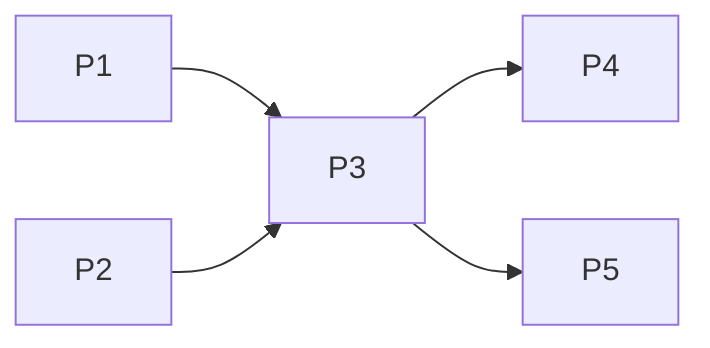
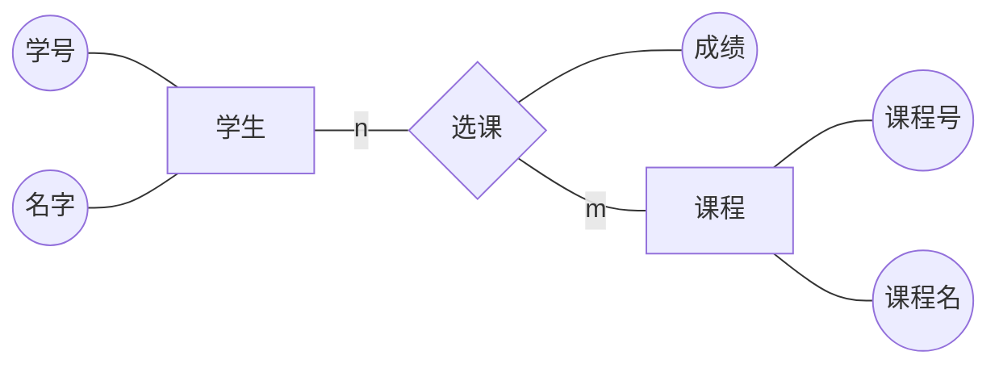
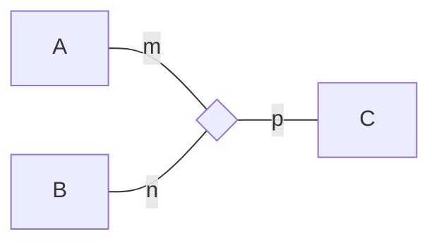
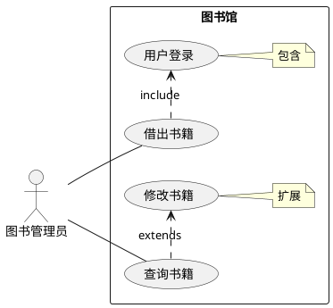
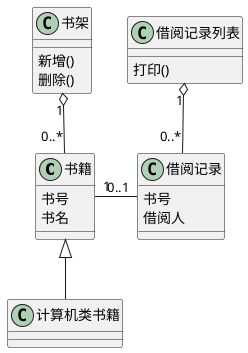
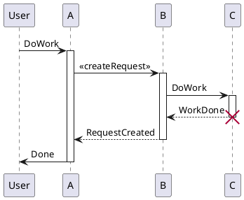
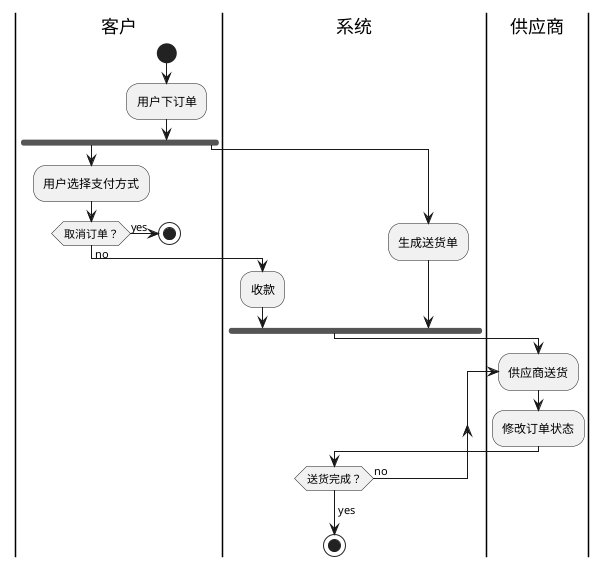
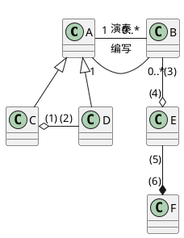
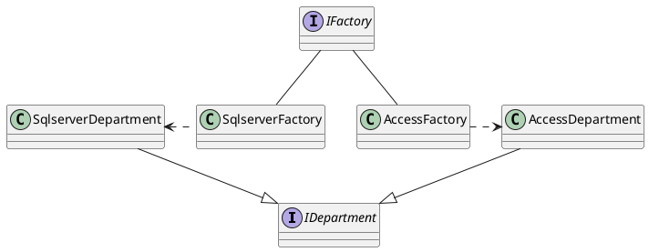
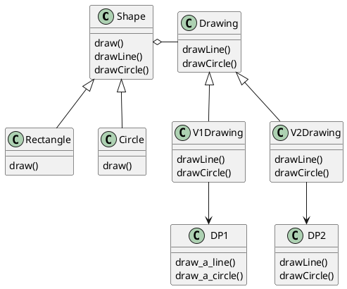

<!-- TOC -->

- [计算机组成原理与体系结构](#计算机组成原理与体系结构)
  - [数据的表示](#数据的表示)
  - [计算机结构](#计算机结构)
  - [Flynn分类法](#flynn分类法)
  - [CISC与RISC](#cisc与risc)
  - [流水线技术](#流水线技术)
  - [存储系统](#存储系统)
  - [总线系统](#总线系统)
  - [可靠性分析](#可靠性分析)
  - [校验码](#校验码)
- [操作系统基础](#操作系统基础)
  - [进程管理](#进程管理)
  - [存储管理](#存储管理)
  - [文件管理](#文件管理)
  - [设备管理](#设备管理)
  - [微内核操作系统](#微内核操作系统)
- [数据库系统](#数据库系统)
  - [数据库模式](#数据库模式)
  - [E-R模型](#e-r模型)
  - [关系代数与元组演算](#关系代数与元组演算)
  - [规范化理论](#规范化理论)
  - [并发控制](#并发控制)
  - [数据库完整性约束](#数据库完整性约束)
  - [数据库安全](#数据库安全)
  - [数据备份](#数据备份)
  - [数据仓库与数据挖掘](#数据仓库与数据挖掘)
  - [大数据](#大数据)
- [计算机网络](#计算机网络)
  - [OSI/RM七层模型](#osirm七层模型)
  - [计算机网络的分类](#计算机网络的分类)
  - [网络规划与设计](#网络规划与设计)
  - [IP地址与子网划分](#ip地址与子网划分)
  - [无线网](#无线网)
  - [网络接入技术](#网络接入技术)
- [系统安全分析与设计](#系统安全分析与设计)
  - [信息系统安全属性](#信息系统安全属性)
  - [信息摘要](#信息摘要)
  - [数字签名](#数字签名)
  - [数字信封与PGP](#数字信封与pgp)
  - [网络安全](#网络安全)
- [数据结构与算法基础](#数据结构与算法基础)
  - [数组与矩阵](#数组与矩阵)
  - [线性表](#线性表)
  - [广义表](#广义表)
  - [树与二叉树](#树与二叉树)
  - [图](#图)
  - [算法基础](#算法基础)
  - [排序与查找](#排序与查找)
- [程序设计语言与语言处理程序基础](#程序设计语言与语言处理程序基础)
  - [编译与解释](#编译与解释)
  - [文法](#文法)
  - [语法推导树](#语法推导树)
  - [有限自动机](#有限自动机)
  - [正规式](#正规式)
  - [表达式](#表达式)
  - [传值与传址](#传值与传址)
  - [多种程序语言特点](#多种程序语言特点)
- [法律法规](#法律法规)
  - [保护期限](#保护期限)
  - [知识产权人确定](#知识产权人确定)
  - [侵权判定](#侵权判定)
  - [标准化](#标准化)
- [多媒体基础](#多媒体基础)
  - [多媒体技术基本概念](#多媒体技术基本概念)
  - [多媒体相关计算问题](#多媒体相关计算问题)
  - [常见多媒体标准](#常见多媒体标准)
  - [数据压缩技术](#数据压缩技术)
- [软件工程](#软件工程)
  - [软件开发模型](#软件开发模型)
  - [需求开发](#需求开发)
  - [结构化设计](#结构化设计)
  - [软件测试](#软件测试)
  - [软件维护](#软件维护)
  - [CMMI](#cmmi)
  - [项目管理](#项目管理)
- [面向对象设计](#面向对象设计)
  - [设计原则](#设计原则)
  - [UML](#uml)
  - [设计模式](#设计模式)
- [数据流图](#数据流图)
- [数据库设计](#数据库设计)
- [UML建模](#uml建模)
- [数据结构与算法应用](#数据结构与算法应用)
- [面向对象程序设计](#面向对象程序设计)

<!-- /TOC -->

## 计算机组成原理与体系结构

### 数据的表示

R进制转十进制：按权展开法。

十进制转R进制：短除法。

原码：符号位+二进制。-(2^n-1^-1)~2^n-1^-1
反码：负数各位取反。-(2^n-1^-1)~2^n-1^-1
补码：负数各位取反+1。-2^n-1^~2^n-1^-1
移码：补码符号位取反。

浮点数：N=M\*R^e^，M为尾数，e为指数，R为基数。

浮点数加法：小阶向大阶对齐，尾数相加，结果格式化。

### 计算机结构

- 主机
  - 主存储器
  - CPU
    - 运算器
      - 算术逻辑单元ALU
      - 累加寄存器AC
      - 数据缓冲寄存器DR
      - 状态条件寄存器PSW（标志位）
    - 控制器
      - 程序计数器PC
      - 指令寄存器IR
      - 指令译码器
      - 时序部件

### Flynn分类法


### CISC与RISC


### 流水线技术

流水线是指在程序执行时，多条指令重叠进行操作的一种准并行处理实现技术。

通过重叠“取指、分析、执行”，同时为多条指令的不同部分进行工作，提高部件利用率和指令执行速度。

流水线周期为一个执行周期中最耗时的环节的执行时间，理论总时间=1条指令执行时间+(n-1)\*流水线周期。实践计算时认为每一环节都占用一个流水线周期，实践总时间=(k+n-1)\*流水线周期。

> 若指令流水线把一条指令分为取指、分析、执行送部分，切三部分执行的时间分别为2ns，2ns，1ns。那么，流水线周期是多少？100条指令全失败执行完毕需要的时间是多少？
> 答：流水线周期2ns，理论时间203ns，实践时间204ns。

流水线的吞吐率TP=指令条数/流水线执行时间。

流水线的最大吞吐率=1/流水线周期。

> 计算上题的吞吐率和最大吞吐率。
> 答：吞吐率100/203，最大吞吐率1/2。

流水线的加速比=不使用流水线的执行时间/使用流水线的执行时间。

> 计算上一题的加速比。
> 答：500/203。

流水线的效率=时空图上流水线的设备利用率。

> 计算如下流水线的效率。
> 
> 答：对4个任务，效率=6\*4/60=40%

### 存储系统


缓存的功能：提高CPU数据输入输出的速率，突破冯诺依曼瓶颈，即CPU与存储系统间数据传送带宽限制。使用Cache改善系统性能的依据是程序的局部性原理。

设h为对Cache的访问命中率，t~1~表示Cache的周期时间，t~2~表示主存储器的周期时间。则整个系统的平均周期为t~3~=h\*t~1~+(1-h)\*t~2~。

局部性原理是指程序往往会在某一时段集中访问某些指令（时间局部性），或某一时段访问某些数据后访问其邻近的数据（空间局部性）。工作集理论：工作集是进程运行时背频繁访问的页面集合。

主存分为随机存储器和只读存储器。

主存的编址：把芯片拼起来，然后分配为内存。

> 内存地址从AC000H到C7FFFH，一共有（）K个地址单元，如果内存地址按字(16bit)编址，由28片存储器芯片构成。构成此内存的芯片每片有16K个存储单元，则该芯片每个存储单元存储（）位。
> 答：共有1C000H个地址单元，即112K。112K\*16bit=28\*16K\*xbit，x=4。

磁盘的存取时间=寻道时间+等待时间。寻道时间是磁头移动到磁道所需的时间，等待时间是等待读写的扇区转到磁头下方所用的时间。

> 设某磁盘每个磁道划分为11个物理区，每块存放1个逻辑记录。R~0~\~R~10~按顺序存放在同一个磁道上。如果磁盘的旋转周期是33ms，磁头当前处于R~0~的开始处。若系统使用单缓冲区处理这些记录，每个记录处理时间为3ms，则处理这11个记录的最长时间为（）。若对信息存储进行优化分布后，处理11个记录的最少时间为（）。
> 答：每次数据处理后，磁盘已经转过下一数据块，必须再转一圈才能处理下一数据块。总计需要366ms。
> 按照R~0~、R~6~、R~1~、R~7~、...、R~4~、R~10~、R~5~的顺序，处理完一个数据块后可以顺势读取下一个数据块，没有时间浪费。总计需要66ms。


### 总线系统

- 内部总线
- 系统总线
  - 数据总线
  - 地址总线
  - 控制总线
- 外部总线

### 可靠性分析

串联系统：

可靠度R=∏R~i~
失效率λ=1-R≈∑λ~i~（当λ~i~较小时）

并联系统：

可靠度：R=1-∏(1-R~i~)

n模冗余模型：m个模块执行相同操作，少数服从多数。

### 校验码

码距是编码系统中任意两个码字间的最小距离。

在一个码组内检测e个误码，要求最小码距应该满足d≥e+1。在一个码组内纠正t个误码，要求最小码距应该满足d≥2t+1。

模二除法：每一位除的结果不影响其它位，不向上一位借位。减法在这里相当于异或，不断作异或使得余数首位为0。


> 原始报文为11001010101，生成多项式是x^4^+x^3^+x+1。对其进行CRC编码后的结果为？
> 答：由生成多项式，给出除数11011。对11001010101xxxx作对11011的模2除法，使之余数为0。110010101010000对11011的余数为0011，故编码结果为110010101010011。

汉明码中，校验码放在2的整数次幂上。校验码位数r：2^r^-1≥r+信息位数。

汉明码的校验规则：第2^i^位的校验码，负责二进制中带有2^i^的数据。

位校验公式，第2^i^位的校验码对应的公式，是所有二进制中带有2^i^的位进行异或后结果为0。

纠正方法：重新计算汉明码，并与原信息的校验码作异或，得到的结果就指示错误出现的位。

> 求信息1011的汉明码。
> 答：2^r^-1≥r+4，r=3。有101x1xx（从高到低7654321）。
> R~1~=R~7~⊕R~5~⊕R~3~=1。
> R~2~=R~7~⊕R~6~⊕R~3~=0。
> R~4~=R~7~⊕R~6~⊕R~5~=0。
> 汉明码为：1010101。

## 操作系统基础

操作系统的功能：管理系统的软硬件、数据资源；控制程序运行；人机之间的借口；应用软件与硬件之间的借口。

操作系统的管理职能：进程管理、存储管理、文件管理、作业管理、设备管理。

### 进程管理


前趋图用于反映流程任务之间的前后依赖关系。

进程的互斥：多个进程争用一个资源。

进程的同步：并行的进程为了在某点相互协调而进行等待。

临界资源：各进程间需要从互斥方式对其进行共享的资源。

临界区：每个进程中访问临界资源的代码。

信号量：根据控制对象的不同而赋予不同的值，操作依据信号量而进行判断。表达资源的可用数或阻塞的进程数。

P操作：S自减1。若S≥0则继续操作，S\<0则置进程阻塞，并加入阻塞队列。

V操作：S自增1。若S\>0则继续操作，若S≤0则从阻塞状态唤醒一个进程，将其插入就绪队列，然后继续操作。

> 单缓冲区生产者、消费者问题PV原语描述：
s1初值1 s2初值0
生产者：
&emsp; 生产一个产品;
&emsp; P(s1);（s1=1则放产品 s1=0则阻塞）
&emsp; 送产品到缓冲区;
&emsp; V(s2);（s2=0则继续生产 s2=-1则生产并唤醒消费者）
消费者：
&emsp; P(s2);（s2=1则取产品 s2=0则阻塞）
&emsp; 从缓冲区取产品;
&emsp; V(s1);（s1=1则继续消费，s1=0则消费并唤醒生产者）
&emsp; 消费产品。

> 补全PV操作。
某书店有一个收银员，最多允许n个购书者进入。设置信号量S1,S2,Sn，初值分别为0,0,n，补全流程。
购书者：
&emsp; 进入书店：P(Sn)
&emsp; 挑选书籍
&emsp; 付款：（a1）、（a2）
&emsp; 离开书店：V(Sn)
收银员：
&emsp; （b1）
&emsp; 收费
&emsp; （b2）
答：顾客唤醒收银员：V(S1)
顾客占用收银员，如果收银员在忙则阻塞：P(S2)
收银员前，若没有顾客则阻塞：P(S1)
收银员收费后唤醒下一个顾客：V(S2)


> 前趋图如上，设置信号量S1,S2,S3,S4，初值均为0，补全PV操作。
P1：执行->（a）
P2：执行->（b）
P3：（c）->执行->（d）
P4：（e）->执行
P5：（f）->执行
答：每一个箭头对应一个信号量，箭头的开始是V操作，结束时P操作。
P4执行前P3未执行完需要先阻塞：e为P(S3)
P5执行前P3未执行完需要先阻塞：f为P(S4)
P3执行完毕后需要唤醒P4和P5：d为V(S3) V(S4)
P3执行前P1和P2未执行完需要先阻塞：c为P(S1) P(S2)
P1执行完毕后需要唤醒P3：V(S1)
P2执行完毕后需要唤醒P3：V(S2)

死锁：如果一个进程等待一个不可能发生的事，则称为死锁。

> 系统由三个进程A、B、C。这三个进程都需要5个系统资源，如果系统至少有多少个资源，则不可能发生死锁？
> 答：先给每个进程分4个，最后剩一个资源则不会死锁。故13个。

死锁的四大条件：互斥、保持和等待、不剥夺、环路等待。

死锁的预防：打破四大条件

死锁的避免：有序资源分配法、银行家算法

银行家算法：进程可以分期请求资源，但请求的总数不能超过最大需求量，当系统现有的资源不能满足进程尚需的资源时，推迟分配，但总能使进程在有限的时间里得到资源。

> 系统由三类互斥资源R1,R2,R3，可用资源数分别为9,8,5。在当前有5个进程，按照（）序列执行，系统状态是安全的。
<table>
<tr><td rowspan=2>进程</td><td colspan=3>最大需求量</td><td colspan=3>已分配资源数</td></tr>
<tr><td>R1</td><td>R2</td><td>R3</td><td>R1</td><td>R2</td><td>R3</td></tr>
<tr><td>P1</td><td>6</td><td>5</td><td>2</td><td>1</td><td>2</td><td>1</td></tr>
<tr><td>P2</td><td>2</td><td>2</td><td>1</td><td>2</td><td>1</td><td>1</td></tr>
<tr><td>P3</td><td>8</td><td>1</td><td>1</td><td>2</td><td>1</td><td>0</td></tr>
<tr><td>P4</td><td>1</td><td>2</td><td>1</td><td>1</td><td>2</td><td>0</td></tr>
<tr><td>P5</td><td>3</td><td>4</td><td>4</td><td>1</td><td>1</td><td>3</td></tr>
</table>

<table>
<tr><td rowspan=2>进程</td><td colspan=3>需求资源数</td></tr>
<tr><td>R1</td><td>R2</td><td>R3</td></tr>
<tr><td>P1</td><td>5</td><td>3</td><td>1</td></tr>
<tr><td>P2</td><td>0</td><td>1</td><td>0</td></tr>
<tr><td>P3</td><td>6</td><td>0</td><td>1</td></tr>
<tr><td>P4</td><td>0</td><td>0</td><td>1</td></tr>
<tr><td>P5</td><td>2</td><td>3</td><td>1</td></tr>
</table>

> 答：R1剩余资源2 R2剩余资源1 R3剩余资源0。
> 剩余的资源只能分配给P2，P2释放后，剩余资源数为 4 2 1。
> 接下来的资源可以分配给P4，之后剩余的资源为5 4 1。
> 以此类推：P2->P4->P5->P1->P3是可行的。

### 存储管理

存储分配算法：首次适应法、最佳适应法、最差适应法、循环首次适应法。

首次适应法：从一开始寻找能放下的空间。

最佳适应法：寻找能放下的最小空间。

最差适应法：寻找最大空间。

循环首次适应法：从上次分配的空间后寻找能放下的空间。

页式存储：将程序和内存分块，维护一个页表，页表内包含块号。逻辑地址包含页号和业内地址，通过页表得到块号，进而得到物理地址。


利用率高，碎片小，分配及管理简单。增加了系统开销，可能产生抖动现象。

> 进程P有6个页面，页号为0\~5，页面大小为4K，页面变换表如下所示。状态为用于表示页面在内存或不在内存。假设系统给进程P分配了4个存储块，进程P要访问的逻辑地址为5A29H，那么经过地址变换后物理地址为（）。如果进程访问的页面4不在内存，那么应该淘汰页号为（）的页面。

|页号|页帧号|状态位|访问位|修改位|
|-|-|-|-|-|
|0|2|1|1|0|
|1|3|1|0|1|
|2|5|1|1|0|
|3|-|0|0|0|
|4|-|0|0|0|
|5|6|1|1|1|

> 4K=1000H，故5A29H中5为页号，对应物理块号6，故物理地址6A29H。
> 应该淘汰访问位为0的页面，故淘汰1号页。

段式存储：按逻辑结构划分段，每段大小可以不等。段表中存储了段号、段长和基地址。


多道程序共享内存，各段程序修改互不影响。内存利用率低，内存碎片浪费大。

段页式存储：结合了段式存储和页式存储。


空间浪费小、存储共享容易。存储保护容易、能动态连接。由于管理软件的增加，复杂性和开销增加，需要的硬件及占有的内容增加，执行速度下降。

快表：一块小容量的相联存储器，在Cache中，速度快，可以从硬件上保证按内容并行查找，一般用于存放当前访问最频繁的少数活动页面的页号。

页面置换算法：最优算法、随机算法、先进先出算法、最近最少使用算法。

> 在一个虚存系统中，进程的内存空间为3页，开始内存为空，有以下访问序列：5 0 1 2 0 3 0 4 2 3 0 3 2 1 2 0 1 5 0 1，应用以下算法，分布计算缺页次数。
> 先进先出算法、最佳适应算法、最近最少使用算法。


> 在一台按字节编址的8位计算机系统中，采用虚拟页式存储管理方案，页面的大小为1KB，且操作系统中没有使用快表。图所示的是划分6个页面的用户程序。

> 图中swap A, B是16位的指令，A和B表示该指令的两个16位操作数。swap指令存放在1023单元中，操作数A存放在3071单元中，操作数B存放在5119单元中。执行swap指令需要访问（）此内存，将产生（）次缺页中断。
> 答：没有使用快表，每次访问内存要先访问页表，所以需要访问内存2次。故需要12次。
> 指令一次读入，只产生一次缺页中断。数据类型产生两次缺页中断。总计5次。

### 文件管理

索引文件结构：将信息存放在不连续的物理块中，用索引表记录物理块号。可以使用多级索引结构。

> 假设文件系统使用索引节点管理，且索引节点有8个地址项iaddr[0]\~iaddr[7]，每个地址项大小为4字节，iaddr[0]\~iaddr[4]采用直接地址索引，iaddr[5]和iaddr[6]采用一级间接地址索引，iaddr[7]采用二级间接地址索引。假设磁盘索引块和磁盘数据块大小均为1KB，文件File1的索引节点如下图所示。若用户访问文件File1中逻辑块为5和261的信息，则对应的物理块号分别为（）和（），101号物理块存放的是（）。

> 答：0\~4采用直接地址，5\~260为第一个一级间接地址，261属于第二个一级间接地址。由图，物理块号分别为58和187。
> 101号物理块存放的是二级地址索引表。

绝对路径是从盘符开始的路径。相对路径是从当前路径开始的路径。

空闲存储空间的管理：空闲区表法、空闲链表法、位示图法、成组链接法。

位示图法：用一位的0或1表示一个物理块的空闲或占用。

> 某文件管理系统在磁盘上建立了位示图。若磁盘物理块编号为0,1,...系统字长为32位，每一位对应一个物理块，0和1分别表示空闲和占用，则将4195号物理块分配给某文件，该物理块的使用情况在位示图的第（）个字中描述，系统的操作是（）。
> 答：4195=32\*131+3，故为第132个字的第3位置1。

### 设备管理

数据传输控制方式：程序控制方式、程序中断方式、DMA方式、通道、输入输出处理机。

Spooling技术：开辟缓冲区，维护一个作业表，将输入设备输入的信息存放在输入井中，并将作业执行的结果存放在输出井中。使得独占使用的设备变成多台虚拟设备。

### 微内核操作系统

微内核操作系统相比于单体内核系统，只实现了基本功能，将图形系统、文件系统、设备驱动及通信功能放在内核之外。

内核精练，便于裁剪和移植。系统服务程序运行在用户地址空间，系统的可靠性、稳定性、安全性较高。可用于分布式系统。

用户状态和内核状态需要频繁切换，从而导致系统效率不如单体内核。

## 数据库系统

### 数据库模式

三级模式-两级映射：


数据库设计过程：


### E-R模型

ER模型用方框表示实体，椭圆表示属性，菱形表示联系。



关系模式是用表格结构表达的实体集与实体集之间的联系。

S(<u>Sno</u>,Sname) ：学生S关系模式，属性为学号、名字
C(<u>Cno</u>,Cname) ：课程C关系模式，属性课程号、课程名
SC(<u>Sno</u>,<u>Cno</u>,Grade) ：选课关系模式，属性为学号、课程号、成绩


E-R模型转关系模式：一个实体转换成一个关系模式，关系可以转换成一个关系模式。1:1联系可以并入任一个关联的实体；1:n联系可以并入n的一端；m:n联系必须转换为一个关系模式。

> 将下E-R模型中，三个不同的实体集和它们之间的多对多联系m:n:p，最少可以转换为（）个关系模式。

> 答：一个实体一个关系模式，一个多对多联系一个关系模式，故至少4个关系模式。


### 关系代数与元组演算

关系代数的运算：并、交、差、笛卡尔积、投影、选择、联接。

### 规范化理论

函数依赖：设一个关系模式中x能确定y，则y依赖于x，记为x→y。（如学号→姓名）。

部分函数依赖：(学号,课程号)→姓名，中，学号→姓名。

传递函数依赖：A→B→C，则A→C。

非规范化中的关系模式可能存在数据冗余、更新异常、插入异常、删除异常。

超键：唯一标识元组的属性或属性组合。

候选键：消除超键中的冗余属性。

主键：从候选键中任选一个。

外键：其他关系的主键。

求候选键的方法：图示法。从入度为0的节点尝试遍历依赖图，若能遍历则是候选键。如果入度为0的节点不能遍历，则将部分中间节点并入入度为0的节点中，遍历所有节点。

> 给定关系R(A1,A2,A3,A4)上的函数依赖集F={A1→A2,A3→A2,A2→A3,A2→A4}，R的候选关键字为（）。
> 答：A1的入度为0，而且可以遍历整个图，故A1为候选键。

> 关系模式P(A,B,C,D,E,F,G,H,I,J)满足函数依赖FD={ABD→E,AB→G,B→F,C→J,CJ→I,G→H}，R的候选关键码（）。
> 答：ABCD。

> 关系模式R(A,B,C)满足函数依赖F={A→BC,B→A,B→C}，R的候选关键码（）。
> 答：A和B。

1NF:属性值都是不可分的原子值，每个分量都是不可再分的数据项。

2NF：在1NF上消除非主属性对候选键的部分依赖。

3NF：在2NF上消除非主属性对候选键的传递依赖。

BCNF：在3NF上消除主属性对候选键的传递依赖，当且仅当依赖集中每个依赖的决定因素必定包含该关系的某个候选码。

> 例：关系模式R(Sn,Cno,Grade,Sname,Cname)有函数依赖集F={Sno→Sname,Cno→Cname,(Sno,Cno)→Grade}，它的每个分量都是不可再分的，故是1NF。变为第二范式。
> 答：(Sno,Cno)是主键，有部分依赖Sno→Sname和Cno→Cname。
> 分为三个关系S(Sno,Sname)、C(Cno,Cname)、G(Sno,Cno,Grade)即可。

> 例：关系模式R(Name姓名,Sno学号,Class班级,Teacher班主任)有函数依赖集D={Sno→Name,Sno→Class,Class→Teacher}。变为第三范式。
> 有传递依赖Sno→Class→Teacher，分为两个关系S(Sno,Name,Class)、C(Class,Teacher)。

> 例：关系模式R(S,T,J)有依赖集F={SJ→T,T→J}，它没有非主属性，所以一定是3NF。候选键有SJ和ST。T→J中T不在SJ中，所以不是BC范式。

> 例：某公司的
> 部门(部门号,部门名,负责人,电话)、
> 商品(商品号,商品名称,单价,库存量)、
> 职工(职工号,姓名,住址)。
> 每个部门有一位负责人和一部电话，但有若干员工；每种商品只能由一个部门进行销售。
> 部门关系不属于第三范式的原因是（）。如果用户要求得到(职工号,姓名,部门名,月销售额)的结果，需要在关系（）上增加（），并增加关系模式（）。
> 答：部门关系消除了非主属性对码的部分函数依赖而未消除传递函数依赖。
> 修改职工关系的结构，增加部门号，可以增加关系模式销售(职工号,商品号,日期,数量)。

模式分解的等价性：保持函数依赖，无损（可以还原）。

> 例：有关系模式成绩(学号,姓名,课程号,课程名,分数)，函数依赖：学号→姓名、课程号→课程名、(学号,课程号)→分数。将其分解为
> 成绩(学号,课程号,分数)
> 学生(学号,姓名)
> 课程(课程号,课程名)
> 是否为无损分解？
> 答：是。

### 并发控制

事务是不应该分割的操作序列，具有原子性、一致性、隔离性、持久性。

一级封锁协议：修改数据前加X锁，事务结束后释放。

二级封锁协议：一级封锁协议的基础上，读数据前加S锁，读完后释放。

三级封锁协议：一级封锁协议的基础上，读数据前加S锁，事务结束后释放。

两段锁协议：可串行化，可能发生死锁。


### 数据库完整性约束

实体完整性约束：主键不能为空或重复。

参照完整性约束：外键必须匹配其他关系中的主键，或为空。

用户自定义完整性约束：用户自定义的规则。

### 数据库安全

用户标识和鉴定、存取控制、密码存储和传输、视图的保护、审计。

### 数据备份

冷备份：静态备份。简单、速度快、容易备份；备份时业务暂停、没有办法精确到表的级别。

热备份：动态备份。灵活、精确备份表级别、备份时间快；复杂度高、难以维护、不得出错。

完全备份：备份所有数据。

差量备份：上一次完全备份后变化的数据。

增量备份：上一次备份后变化的数据。

静态海量存储：在系统无运行事务时进行，每次转储全部数据库。

静态增量转储：在系统无运行事务时进行，每次只转储上一次转储后更新过的数据。

动态海量转储：转储期间允许对数据库进行存取或修改，每次转储全部数据库。

动态增量转储：转储期间允许对数据库进行存取或修改，每次只转储上一次转储后更新过的数据。

日志文件：事务日志是针对数据库改变所做的记录，它可以记录针对数据库的任何操作，并记录结果。

### 数据仓库与数据挖掘

数据仓库主要用于保存历史数据，侧重于保持这些相对稳定的数据，便于大批量的数据处理，面向分析和决策的数据库。

数据仓库是面向主题、集成、相对稳定的、反映历史变化。

数据挖掘的方法：
- 决策树
- 神经网络
- 遗传算法
- 关联规则挖掘算法

数据挖掘的分类：
- 关联分析
- 序列模式分析
- 分类分析
- 聚类分析

规范化会对表进行拆分，提高增、删、改的速度，但会降低查询效率。

反规范化技术手段：
- 增加派生性冗余列
- 增加冗余列
- 重新组表
- 分割表

### 大数据

大量化、多样化、价值密度低、快速化。

## 计算机网络

### OSI/RM七层模型

- 物理层：二进制传输；中继器、集线器。
- 数据链路层：信息帧传输；网桥、交换机、网卡。
- 网络层：分组传输和路由选择；三层交换机、路由器。
- 传输层：端到端的连接。
- 会话层：建立、管理和终止会话。
- 表示层：数据的格式与表达、加密、压缩。
- 应用层：实现具体的应用功能。

> 某IP网络连接如图所示，在这种配置下IP分组广播不能通过的路径（）。
> 
> IP全局广播只能在同一局域网中广播，无法跨过路由器。

TCP/IP协议：Internet，可扩展，可靠，应用最广，牺牲速度和效率。

IPX/SPX协议：NOVELL，路由，大型企业网。

NETBEUI协议：IBM，非路由，快速。


TCP传输协议：可靠，面向连接。

UDP传输协议：不可靠，无连接。

DHCP：动态IP地址分配。

DNS：域名解析。主机向本地域名服务器的查询使用递归查询（回答IP地址）；本地域名服务器向根域名服务器的查询常采用迭代查询（回答IP或其他DNS服务器的地址）。


> 主机host1对host2进行域名查询的过程如图所示，根域名服务器和中介域名服务器的查询方式？
> 
> 根域名服务器采用迭代查询，中介域名服务器采用递归查询。

### 计算机网络的分类

分布范围：局域网LAN、城域网MAN、广域网WAN、因特网。

按拓扑结构分：总线型、星型、环形。

### 网络规划与设计


逻辑网络设计：利用需求分析和现有网络体系分析的结果来设计逻辑网络结构，最后得到一份逻辑网络设计文档。

物理网络设计：对逻辑网络设计的物理实现，通过对设备的具体物理分布、运行环境等确定，确保网络的物理连接符合逻辑连接的要求。

分层设计：
- 接入层：向本地网段提供用户接入
- 汇聚层：网络访问策略控制、数据包处理、过滤、寻址。
- 核心层：数据交换。

### IP地址与子网划分

- A类：0.0.0.0-127.255.255.255（前8位为网络号，后24位为主机号）
- B类：128.0.0.0-191.255.255.255（前16位为网络号）
- C类：192.0.0.0-223.255.255.255（前24位为网络号）
- D类组播：224.0.0.0-239.255.255.255
- E类组播：240.0.0.0-255.255.255.255

全0的主机号和全1的主机号不使用。

> 将B类地址168.195.0.0划分为27个子网，子网掩码为多少？
> 1010 1000 .1100 0011 .0000 0000 .0000 0000
> 需要划分为32个子网，需要5位 故子网掩码为/21
> 255.255.248.0

> 将B类地址168.195.0.0划分为若干子网，每个子网内有700台主机，求子网掩码。
> 可以分配1022个主机的子网 故子网掩码为/22
> 255.255.252.0

> 分配给某公司的地址块是210.155.192.0/20则该网络可以被划分为（）个C类子网。
> C类子网/24，故16个。

无类域间路由：IP地址/地址块

- 127网段：回播地址
- 网络号全0：当前子网中的主机
- 全1地址：本地子网的广播
- 主机号全1：特定子网的广播
- 10.0.0.0/8 172.16.0.0/12 192.168.0.0/16
- 169.254.0.0 保留地址 DHCP失效（Windows）
- 0.0.0.0 保留地址 DHCP失效（Linux）

### 无线网

- 无线局域网 WLAN 802.11 Wi-Fi
- 无线城域网 WMAN 802.16 WiMax
- 无线广域网 WWAN 3G/4G
- 无线个人网 WPAN 802.15 蓝牙

### 网络接入技术

有线接入：
- PSTN公用交换电话网络
- DDN数字数据网
- ISDN综合业务数据网
- ADSL非对称数据用户网络
- HFC同轴光纤技术

无线接入：
- IEEE 802.11(WiFi)
- IEEE 802.15(蓝牙)
- 红外
- WAPI

3G：
- WCDMA
- CDMA2000
- TD-SCDMA

- 4G：
- LTE-Advanced
- WirelessMAN-Advanced(802.16m)（WiMAX）

## 系统安全分析与设计

### 信息系统安全属性

安全属性：
- 保密性：最小授权原则、防暴露、信息加密、物理保密
- 完整性：安全协议、校验码、密码校验、数字签名、公证
- 可用性：综合保障（IP过滤、业务流控制、路由选择控制、审计跟踪）
- 不可抵赖性：数字签名

对称加密算法：DES、3DES、AES、RC-5、IDEA。
加密强度不高、密钥分发困难。

非对称加密算法：RSA、Elgamal(Diffie-Hellman算法)、ECC、背包算法、Rabin、D-H。
加密速度慢。

### 信息摘要

信息摘要采用单向Hash函数。

常见的信息摘要算法：MD5、SHA。

### 数字签名

用自己的私钥加密称为数字签名过程，用公钥解密称为验证过程。

很多时候是对摘要进行签名。

### 数字信封与PGP

发送方将原文用对称秘钥加密，而降对称秘钥用接收方公钥加密发送。

接收方收到电子信封，用自己的私钥解密，得到对称秘钥后解密。

PGP承认PGP证书和X.509证书。

> 要求邮件以加密方式传输，邮件最大附件内容500M，发送者不可抵赖，若邮件被第三方截获，第三方无法篡改。
> 需要对称加密（大数据量）、数字签名（不可抵赖）、信息摘要技术（第三方无法篡改）。
> 

### 网络安全


- 重放攻击（ARP）：所截获的某次合法的通信数据拷贝，处于非法的目的而被重新发送。
- 拒绝服务（DOS）：对信息或其他资源的合法访问被无条件地阻止。
- 窃听：用各种可能的合法或非法的手段窃取系统中的信息资源和敏感信息。例如对通信线路中传输的信号进行搭线监听，或者利用通信设备在工作过程中产生的电磁泄露截取有用信息等。
- 业务流分析：通过对系统进行长期监听，利用统计分析方法对诸如通信频度、通信的信息流向、信息总量的变化等菜蔬进行研究，从而发现有价值的信息和规律。
- 信息泄露：信息被泄露或透露给某个非授权的实体。
- 破坏信息的完整性：数据被非授权地进行增删、修改或破坏而受到损失。
- 非授权访问：某一资源被某个非授权的人、或以非授权的方式使用。
- 假冒：通过欺骗通信系统（或用户）达到非法用户冒充成为合法用户，或者特权小的用户冒充成为特权大的用户的目的。黑客大多是采用假冒进行攻击。
- 旁路控制：攻击者利用系统的安全缺陷或安全性上的脆弱之处获得非授权的权利或特权。例如，攻击者通过各种攻击手段发现原本应保密，但是却又暴露出来的一些系统"特性"。利用这些“特性"，攻击者可以绕过防线守卫者侵入系统的内部。
- 授权侵犯：被授权以某一目的使用某一系统资源的某个人，却将此权限用于具它非授权的目的，也称作“内部攻击”
- 特洛伊木马：软件中含有一个察觉不出的或者无害的程序段，当它被执行时，会破坏用户的安全。
- 陷阱门：在某个系统或某个部件中设置了“机关"，使得当提供特定的输入数据时允许违反安全策略。
- 抵赖：这是一种来自用户的攻击，比如：否认自己经发布过的某条消息、伪造一份对方来信等。

防火墙：


## 数据结构与算法基础

### 数组与矩阵

一位数组a[n]：a[i]的存储地址 a+i\*size
二维数组a[m][n]：a[i][j]按行存储：a+(i\*n+j)\*size、按列存储a+(j\*m+i)*size

> 已知5行5列的二维数组a中各元素占两个字节，求元素a[2][3]按行优先存储的存储地址。
> a+13\*2=a+26

上三角矩阵：a[i][j] (2n-i+1)\*i/2+j
下三角矩阵：a[i][j] (i+1)\*i/2+j

> 设有左下三角矩阵A[0..8,0..8]，将该三角矩阵的非零元素按行优先顺序存储在M[1..m]中，则元素A[i,j](j≤i)存储在M的（）。
> M[i\*(i+1)/2+j+1]

### 线性表

线性表的存储结构：顺序表、链表（单链表、循环链表、双向链表）。


> 元素按照a、b、c的次序进入栈，常事写出所有可能的出栈序列。
> acb/acb/bac/bca/cba。

> 输出受限的双端队列可以从两端输入，但只能从一端输出。若e1、e2、e3、e4依次入队，则不可能得出的输出队列：
> e4、e2、e3、e1

### 广义表

广义表是由线性表组成的表，一般由递归定义。广义表的长度是所含元素的个数，深度是指广义表递归的重数。

表头是第一个元素、表尾是除了第一个元素以外的其他元素。

> 广义表LS1=(a,(b,c),(d,e))，则长度和深度为？
> 长度3，深度2。

> 广义表LS1=(a,(b,c),(d,e))，取出其中的元素b。
> head(head(tail()LS1))。

### 树与二叉树

结点的度：结点拥有的子节点数。
树的度：最大的结点的度。
叶子结点：没有子节点。
分支节点：有子节点。
内部节点：不是叶子结点或根节点。
兄弟结点：同层次的结点。

满二叉树：按层次填满的二叉树。
完全二叉树：按层次顺序填入的二叉树。

- 二叉树的第i层上最多有2^i-1^个结点；
- 深度为k的二叉树最多有2^k^-1个结点；
- 对任何一个二叉树，如果其叶子节点数为n~0~，度为2的节点数为n~2~，则n~0~=n~2~+1。
- 如果对一个有n个结点的完全二叉树的结点按层序标号，则对任何一个结点i：
  - i=1没有父节点，如果i>1，则父节点是⌊i/2⌋；
  - 2i\>n，则结点i为叶子结点，无左子节点；否则，其左子节点是2i；
  - 2i+1\>n，则结点i无右子节点，否则，其右子结点是2i+1。

前序遍历：根节点、左子树、右子树
中序遍历：左子树、根节点、右子树
后序遍历：左子树、右子树、根节点
层次遍历


> 遍历：
> 
> 前序遍历：12457836
> 中序遍历：42785136
> 后序遍历：48752631
> 层次遍历：12345678

> 由前序序列ABHFDECG，中序序列HBEDFAGC构造二叉树。
> 

树转二叉树：孩子结点变左子树结点，兄弟结点变右子树结点。


二叉排序树：左孩子小于根、右孩子大于根。

插入结点：
- 如果结点已存在，则不插入；
- 若为空树，则创建二叉树；
- 与父节点比较，确定是左结点还是右节点。

删除结点：
- 叶子结点直接删除；
- 如果只有一个子节点，则将该子节点与父节点直接连接。
- 若p有两个子节点，则在左子树上用中序遍历寻找最大的s代替p，删除s。

哈夫曼树：最小化树的带权路径长度
路径长度：从根节点出发到叶子结点的路径条数。
权：结点的值。
带权路径长度：路径长度\*权。
树的带权路径长度：所有叶子节点的带权路径长度的和。

构造哈夫曼树：选取最小的两个节点，相加作为新节点。以此不断重复。

> 例：设有5,29,7,8,14,23,3,11构建
> 最小的是3 5 合并为8 有7,8,8,11,14,23,29
> 最小的是7 8 合并为15 有 8,11,14,15,23,29
> ...
> 

线索二叉树：给叶子结点加指向其他结点的指针。

左指针指向遍历的前驱结点，右指针指向遍历的后序结点。


平衡二叉树：任意节点的左右子树深度相差不超过1。

平衡度：左子树深度-右子树深度

### 图

图中所有能连的边都连上了就叫做完全图。

邻接矩阵：R~ij~表示ij有无邻接边。无向图的邻接矩阵是对称矩阵。


邻接表：把每个顶点的邻接定点用链表示出来，然后用一维数组存储头指针。


深度优先遍历、广度优先遍历。

拓扑排序：表达事件开始的先后顺序的有向图。

拓扑序列：满足先后顺序的一个事件先后顺序的序列。

图的最小生成树：去掉多余的边，让剩余的图依然连通，且权值最小。

Prim算法（加点法）：从结点出发，每次选择能够接触到的最小权值路径对应的点。

Kruskal算法（加边法）：每次选择最小权值的路径。

### 算法基础

算法的特性：有穷性、确定性、输入≥0、输出≥1、有效性。

时间复杂度：程序运行的时间。

空间复杂度：临时变量占用的空间。

### 排序与查找

顺序查找：按顺序查找。平均查找长度(n+1)/2。

二分查找：有序表每次比较其中中间的元素。mid为两个端点号求和向下取整，对比之后刨除边界。

散列表：按散列函数将数据存入地址。

稳定排序：相同数字保持顺序。（不稳定排序不包吃）

- 插入类排序：直接插入排序、希尔排序。
- 交换类排序：冒泡排序、选择排序。
- 选择类排序：简单选择排序、堆排序。
- 归并排序。
- 基数排序。

直接插入排序：前i-1个排序已经排好，将第i个数字插入到中间。

希尔排序：每隔d个元素取出一组，组内直接插入排序。不断减小d。

直接选择排序：选出剩余元素中最小的元素，与第一个交换。

堆排序：
小顶堆：完全二叉树中，父亲小于等于孩子
大顶堆：完全二叉树中，父亲大于等于孩子
建堆：从最后一个非叶子结点向前层次遍历。每个节点重建堆。
取走根结点，然后把最后一个元素放到根结点。以根节点开始重建堆。
重建堆：如果不满足大顶堆规则，则和较大的孩子交换，并保证其下的子节点不破坏大顶堆规则，否则也进行交换。

冒泡排序：对于相邻的两个元素，交换使其有序。

快速排序：选择基准，从两端向中间遍历，把小于基准的数交换到前面，大于基准的数交换从后面。

归并排序：把两个有序表合并成较大的有序表。

基数排序：按个位、十位、百位、...的顺序，在每一位中进行排序。


## 程序设计语言与语言处理程序基础

### 编译与解释


### 文法

一个形式文法是一个有序四元组G=(V,T,S,P)。

V：非终结符、T：终结符、S：起始符、P：产生式。


正则闭包：A^+^=A^1^∪A^2^∪...∪A^n^∪...

闭包：A^\*^=A^0^∪A^+^


### 语法推导树

> 文法G=({a,b},{S,A},S,P)，其中：
> S→aAS|a A→SbA|SS|ba。
> 构造aabAa的推导树。
> 答：S→aAS→a(SbA)(a)→aSbAa→a(a)bAa→aabAa。

### 有限自动机

有限自动机用M=(S,Σ,δ,S0,Z)表示。

S是一个有限状态集，Σ是输入字符集，δ是单值转换函数，S0属于S，是初态，Z是终态集。

有限自动机可以用状态转换图形象地表示。

> 设DFA=({S,A,B,C,f},{1,0},δ,S,{f})，其中
> δ(S,0)=B,δ(S,1)=A,δ(A,0)=f,δ(A,1)=C,δ(B,0)=C,δ(B,1)=f,δ(C,0)=f,δ(C,1)=f。
> 


> 下图为一个有限自动机，该自动机可识别0101。
> 
> 看哪个能从起点A走到终点C。

### 正规式

正规式是描述程序语言单词的表达式。正规式由字母、或、连接、闭包运算符构成。

> 下面文法G[S]无法识别babba。此文法对应的正规式是(ab|ba)^\*^。
> S→aA|bB、A→bS|b、B→aS|a。
> babba无法由文法G从S推导得出，G从S只能推导出(ab|ba)^\*^。

### 表达式

表达式可以有前缀表达式、中缀表达式、后缀表达式。

> (a-b)\*(c+5)的后缀式是（）。
> 答：a b - c 5 + *

### 传值与传址

### 多种程序语言特点

- Fortran语言（科学计算，执行效率高）
- Pascal语言（为教学而开发的，表达能力强，Delphi）
- C语言（指针操作能力强，高效）
- Lisp语言（函数式程序语言，符号处理，人工智能）
- C++语言（面向对象，高效）
- Java语言（面向对象，中间代码，跨平台）
- C##语言（面向对象，中间代码，.Net）
- PRrolog语言（逻辑推理，简洁性，表达能力，数据库和专家系统）

## 法律法规

知识产权：
- 著作权及邻接权；
- 专利权；
- 工业品外观设计权；
- 商标权；
- 地理标志权；
- 集成电路布图设计权

### 保护期限


### 知识产权人确定


### 侵权判定

中国公民、法人或者其他组织的作品，不论是否发表，都享有著作权。

开发软件所用的思想、处理过程、操作方法或者数学概念不受保护。

著作权法不适用于下列情形：
- 法律、法规，国家机关的决议、决定、命令和其他具有立法、行政、司法性质的文件，及其官方正式译文；
- 时事新闻；
- 历法、通用数表、通用表格和公式。


### 标准化


## 多媒体基础

### 多媒体技术基本概念

音频：

声音的带宽：
- 人耳：20Hz-20kHz
- 说话：300Hz-3400Hz
- 乐器：20Hz-20kHz

采样频率应问声音最高频率的2倍。

图像：

亮度、色调、饱和度。

彩色空间：RGB、YUV（电视，兼容）、CMY（印刷，CMYK）、HSV（HSB）。

感觉媒体：指人们接触信息的感觉形式。如：视觉、听觉、触觉、嗅觉和味觉等。
表示媒体：指信息的表示形式。如：文字、图形、图像、动画、音频和视频等。
显示媒体（表现媒体）：表现和获取信息的物理设备。如：输入显示媒体键盘、鼠标和麦克风等；输出显示媒体显示器、打印机和音箱等。
存储媒体：存储数据的物理设备，如磁盘、光盘和内存等。
传输媒体：传输数据的物理载体，如电缆、光缆和交换设备等。

### 多媒体相关计算问题

图像容量计算：像素\*位数/8字节

> 某数码相机内置128MB的存储空间，拍摄分辨率设定为1600×1200像素，颜色深度为24位，若不采用压缩存储技术，使用内部存储器最多可以存储（）张照片。
> 1600×1200×3÷1024÷1024=5.493 128/5.493=23.3。

音频容量计算：采样频率(Hz)\*量化/采样位数\*声道数/8

> CD上声音的采样频率为44.1kHz，样本精度为16bit，双声道立体声，那么未经压缩的数据传输率为（）kb/s。
> 44.1×16×2=1411.2kb/s。

视频容量计算：每帧图像容量\*帧率\*+音频容量\*时间

> 若视频图像每帧的数据量为6.4MB，帧速率为30帧/秒，则显示10秒的视频信息。其原始数据量为（）MB。
> 64×30×10=1920。

### 常见多媒体标准


### 数据压缩技术

- 空间冗余（几何冗余）
- 时间冗余
- 视觉冗余
- 信息熵冗余
- 结构冗余
- 知识冗余

无损压缩法称为熵编码法；有损压缩称为熵压缩法。


## 软件工程

### 软件开发模型

瀑布模型：结构化方法的模型，一般应用于结构化的开发，适用于需求明确的开发或二次开发。


V模型：


原型模型：强调构造一个简易的系统，针对需求不明确的情况。

螺旋模型：结合了瀑布模模型和演化模型，引入了风险分析。


喷泉模型：面向对象模型，具有迭代性和无间隙性。

RAD：瀑布模型+构件组装模型CBSD。

CBSD：


敏捷开发方法：小项目，小步快跑。


信息系统开发方法：


### 需求开发


### 结构化设计


### 软件测试


环路复杂度=有向箭头数-节点数+2=判断语句数+1=封闭区域数量+1

### 软件维护


### CMMI


### 项目管理

Gantt图：能清晰地描述每个任务从何时开始，到何时结束，以及任务之间的并行关系。但是不能清晰地反映出各任务之间的依赖关系。

PERT图：


> 下图所示的PERT图中，事件6的最晚开始时间是（）
> 
> 先正推最早开始时刻，再倒推最晚开始时刻。
> 最晚开始时间是10。

风险是指损失或伤害的可能性。

- 项目风险
- 技术风险
- 商业风险

风险曝光度=风险出现的概率\*风险可能造成的损失

## 面向对象设计

### 设计原则

- 单一职责原则:设计目的单一的类
- 开闭原则：对扩展开放，对修改封闭
- 李氏替换原则：子类可以替换父类
- 依赖倒置原则：要依赖于抽象，而不是具体实现；针对接口编程，不要针对实现编程
- 接口隔离原则：使用多个专门的接口比使用单一的总接口好
- 组合重用原则：要尽量使用组合，而不是继承关系打到重用目的
- 最小知识法则：一个对象应当对其他对象有尽可能的了解

### UML


### 设计模式

- 架构模式：软件设计中的高层决策

- 架构模式：软件设计中的高层决策，例如C/S结构就属于架构模式，架构模式反映了开发软件系统过程中所作的基本设计决策。
- 设计模式：主要关注软件系统的设计，与具体的实现语言无关。
- 惯用法：是最低层的模式，关注软件系统的设计与实现，实现时通过某种持定的程序设计语言来描述构件与构件之间的关系。每种编程语言都有它自己特定的模式，即语言的惯用法。例如引用-计数就是C++语言中的一种惯用法。


创建型模式：
- 抽象工厂模式（Abstract Factory）：提供一个接口，可以创建一系列相关或相互依赖的对象，而无需指定它们具体的类。
- 构建器模式（Builder）：将一个复杂类的表示与其构造相分离，使得相同的构建过程能够得出不同的表示。
- 工厂方法模式（Factory Method）：定义一个创建对象的接口，但由子类决定需要实例化哪一个类。工厂方法使得子类实例化的过程推迟。
- 原型模式（Prototype）：用原型实例指定创建对象的类型，并且通过拷贝这个原型来创建新的对象。
- 单例模式（Singleton）：保证一个类只有一个实例，并提供一个访问它的全局访问点。

结构型模式：
- 适配器模式（Adapter）：将一个类的接口转换成用户希望得到的另一种接口。它使原本不相容的接口得以协同工作。（转换接口）
- 桥接模式（Bridge）：将类的抽象部分和它的实现部分分离开来，使它们可以独立地变化。（继承树拆分）
- 组合模式（Composite）：将对象组合成树型结构以表示“整体-部分”的层次结构，使得用户对单个对象和组合对象的使用具有一致性。（树形目录结构）
- 装饰模式（Decorator）：动态地给一个对象添加一些额外的职责。它提供了用子类扩展功能的一个灵活的替代，比派生一个了类更加灵活。（附加职责）
- 外观模式（Facade）：定义一个高层接口，为子系统中的一组接口提供一个一致的外观，从而简化了该了系统的使用。（对外统一接口）
- 享元模式（Flyweight）：提供支持大量细粒度对象共享的有效方法。
- 代理模式（Proxy）：为其他对象提供一种代理以控制这个对象的访问

行为型模式：
- 职责链模式（Chain of Responsibility）：通过给多个对象处理请求的机会，减少请求的发送者与接收者之间的耦合。将接收对象链接起来，在链中传请求，直到有一个对象处理这个请求。（传递职责）
- 命令模式（Command）：将一个请求封装为一个对象，从而可用不同的请求对客户进行参数化，将请求排队或记录请求日志，支持可撤销的操作。（日志记录，可撤销）
- 解释器模式（Interpreter）：给定一种语言，定义它的文法表示，并定义一个解释器，该解释器用来根据文法表示来解释语言中的句子。
- 迭代器模式（Iterator）：提供一种方法来顺序访问一个聚合对象中的各个元素而不需要暴露该对象的内部表示。
- 中介者模式（Mediator）：用一个中介对象来封装一系列的对象交互。它使各对象不需要显式地相互调用，从而达到低耦合，还可以独立地改变对象间的交互。（不直接引用）
- 备忘录模式（Memento）：在不破坏封装性的前提下，捕获一个对象的内部状态，并在该对象之外保存这个状态，从而可以在以后将该对象恢复到原先保存的状态。
- 观察者模式（Observer）：定义对象间的一种一对多的依赖关系，当一个对象的状态发生改变时，所有依赖于它的对象都得到通知并自动更新。
- 状态模式（State）：允许一个对象在其内部状态改变时改变它的行为。（状态变成类）
- 策略模式（Strategy）：定义一系列算法，把它们一个个封装起来，并且使它们之间可互相替换，从而让算法可以独立于使用它的用户而变化。（多方案切换）
- 模板方法模式（Template Method）：定义一个操作中的算法骨架，而将一些步骤延迟到子类中，使得子类可以不改变一个算法的结构即可重新定义算法的某些特定步骤。
- 访问者模式（Visitor）：表示一个作用于某对象结构中的各元素的操作，使得在不改变各元素的类的前提下定义作用于这些元素的新操作。

## 数据流图


数据流图平衡原则：
- 父图与子图之间平衡
- 子图内平衡

**阅读下列说明和图，回答问题1至问题4，将解答填入答题纸的对应栏内。**
〖说明〗
某大型企业的数据中心为了集中管理、控制用户对数据的访问并支持大量的连接需求，欲构建数据管理中间件，其主要功能如下：
（1）数据管理员可通过中间件进行用户管理、操作管理和权限管理。用户管理维护用户信息，用户信息（用户名、密码）存储在用户表中；操作管理维护数据实体的标准操作及其所属的后端数据库信息，标准操作和后端数据库信息存放在操作表中；权限管理维护权限表，该表存储用户可执行的操作信息。
（2）中间件验证前端应用提供的用户信息。若验证不通过，返回非法用户信息；若验证通过，中间件将等待前端应用提交操作请求。
（3）前端应用提交操作请求后，中间件先对请求进行格式检查。如果格式不正确，返回格式错误信息；如果格式正确，则进行权限验证（验证用户是否有权执行请求的操作），若用户无权执行该操作，则返回权限不足信息，否则进行连接管理。
（4）连接管理连接相应的后台数据库并提交操作。连接管理先检查是否存在空闲的数据库连接，如果不存在，新建连接；如果存在，则重用连接。
（5）后端数据库执行操作并将结果传给中间件，中间件对收到的操作结果进行处理后，将其返回给前端应用。
现采用结构化方法对系统进行分析与设计，获得如图11-1所示的顶层数据流图和图11-2所示的0层数据流图。

〖问题1〗（3分）
使用说明中的词语，给出图11-1中的实体E1-E3的名称。
〖问题2〗（3分）
使用说明中的词语，给出图11-2中的数据存储D1-D3的名称。
〖问题3〗（6分）
给出图11-2中加工P的名称及其输入、输出流。
除加工P的输入与输出流外，图11-2还缺失了两条数据流，请给出这两条数据流的起点和终点。
注：名称使用说明中的词汇，起点和终点均使用图11-2中的符号或词汇。
〖问题4〗（3分）
在绘制数据流图时，需要注意加工的绘制。请给出三种在绘制加工的输入、输出时可能出现的错误。
> 答：
> 【1】：前端应用、数据库管理员、后端数据库。
> 【2】：操作结果E3→P；处理后的操作结果P→E1。
> 【3】：D2→权限验证；D3→权限验证。
> 【4】：数据流不平衡：有入没有出、有出没有入。数据流命名错误：输入流和输出流命名相同、输入流不可能经过加工得到的输出流。

**阅读以下说明和数据流图，回答问题1至问题4，将解答填入答题纸的对应栏内。**
〖说明〗
现准备为某银行开发一个信用卡管理系统CCMS，该系统的基本功能为：
1．信用卡申请。非信用卡客户填写信用卡申请表，说明所要申请的信用卡类型及申请者的基本信息，提交CCMS。如果信用卡申请被银行接受，CCMS将记录该客户的基本信息，并发送确认函给该客户，告知客户信用卡的有效期及信贷限额；否则该客户将会收到一封拒绝函。非信用卡客户收到确认函后成为信用卡客户。
2．信用卡激活。信用卡客户向提交激活请求，用信用卡号和密码激活该信用卡。激活操作结束后，CCMS将激活通知发送给客户，告知客户其信用卡是否被成功激活。
3．信用卡客户信息管理。信用卡客户的个人信息可以在CCMS中进行在线管理。每位信用卡客户可以在线查询和修改个人信息。
4，交易信息查询。信用卡客户使用信用卡进行的每一笔交易都会记录在CCMS中。信用卡客户可以通过查询并核实其交易信息（包括信用卡交易记录及交易额）。
图11-3和图11-4以分别给出了该系统的顶层数据流图和0层数据流图的初稿。

〖问题1〗（3分）
根据〖说明〗，将图11-3中的E1-E3填充完整。
〖问题2〗（3分）
图11-3中缺少三条数据流，根据〖说明〗，分别指出这三条数据流的起点和终点。（注：数据流的起点和终点均采用图中的符号和描述）
〖问题3〗（5分）
图11-4中有两条数据流是错误的，请指出这两条数据流的名称，并改正。（注：数据流的起点和终点均采用图中的符号和描述）
〖问题4〗（4分）
根据〖说明〗，将图11-4中P1-P4的处理名称填充完整。
> 答：
> 【1】：非信用卡客户、信用卡客户、银行。
> 【2】：E1→P0、E2→P0、P0→E2
> 【3】：信用卡申请表E1→P4、激活请求E2→P3。
> 【4】：交易信息查询、信用卡客户信息管理、信用卡激活、信用卡申请。

## 数据库设计

**公司拟开发一个宾馆客房预订子系统，主要是针对客房的预订和入住等情况进行管理。**
〖需求分析结果〗
（1)员工信息主要包括：员工号、姓名、出生年月、性别、部门、岗位、住址、联系电话和密码等信息。岗位有管理和服务两种。岗位为“管理”的员工可以更改（添加、删除和修改）员工表中的本部门员工的岗位和密码，要求将每一次更改前的信息保留；岗位为“服务”的员工只能修改员工表中本人的密码，且负责多个客房的清理等工作。
（2）部门信息主要包括：部门号、部门名称、部门负责人、电话等信息；一个员工只能属于一个部门，一个部门只有一位负责人。
（3）客房信息包括：客房号、类型、价格、状态等信息。其中类型是指单人间、三人间、普通标准间、豪华标准间等：状态是指空闲、入住和维修。
（4）客户信息包括：身份证号、姓名、性别、单位和联系电话。
（5）客房预定情况包括：客房号、预定日期、预定入住日期、预定入住天数、身份证号等信息。一条预定信息必须仅对应一位客户，但一位客户可以有多条预定信息。
〖概念模型设计〗
根据需求阶段收集的信息，设计的实体-联系图（不完整）如图12-1所示。

〖逻辑结构设计〗
逻辑结构设计阶段设计的部分关系模式（不完整）如下:
员工（(4)，姓名，出生年月，性别，岗位，住址，联系电话，密码）
权限（岗位，操作权限）
部门（部门号，部门名称，部门负责人，电话）
客房（(5)，类型，价格，状态，入住日期，入住时间、员工号）
客户（(6)，姓名，性别，单位，联系电话）
更改权限（员工号，(7)，密码，更改日期，更改时间，管理员号）
预定情况（(8)，预定日期，预定入住日期，预定入住天数）
〖问题1〗（3分）
根据问题描述，填写图12·1中(1)-(3)处联系的类型。联系类型分为一对一、一对多和多对多3种，分别使用1:1、1:n或1:\*、m:n或\*:\*表示。
〖问题2〗（2分）
补充图12-1中的联系并指明其联系类型。
〖问题3〗（7分）
根据需求分折结果和图12-1，将逻辑结构设计阶段生成的关系模式中的空(4)-(8)补充完整。（注：一个空可能需要填多个属性。）
〖问题4〗（3分）
若去掉权限表，井将权限表中的操作权限属性放在员工表中（仍保持管理和服务岗位的操作权限规定），则与原有设计相比有什么优缺点（请从数据库设计的角度说明）。
> 答：
> 【1】：部门对员工1:n、客户对客房m:n。
> 【2】：员工对权限n:1。
> 【3】：(4)员工号，部门号、(5)客房号、(6)身份证号、(7)岗位、(8)客房号，身份证号。
> 【4】：减少了连接操作，查询速度加快，但增加了数据冗余。

**阅读下列说明，回答问题1至问题3，将解答填入答题纸的对应栏内。**
〖说明〗
某集团公司拥有多个大型连锁商场，公司需要构建一个数据库系统以方便管理其业务运作活动。
〖需求分析结果〗
1.商场需要记录的信息包括商场编号（编号唯一），商场名称，地址和联系电话。某商场信息如表12-1所示。
表12-1 商场信息表
|商场编号|商场名称|地址|联系电话|
|-|-|-|-|
|PS2101|淮海商场  |淮海中路918号      |021-64158818|
|PS2902|西大街商场|西大街时代盛典大厦  |029-87283220|
|PS2903|东大街商场|碑林区东大街239号  |029-87450287|
|PS2901|长安商场  |雁塔区长安中路38号 |029-85264953|
2.每个商场包含有不同的部门，部门需要记录的信息包括部门编号（集团公司分配），部门名称，位置分布和联系电话。某商场的部门信息如表12-2所示。
表12-2部门信息表
|部门编号|部门名称|位置分布|联系电话|
|-|-|-|-|
|DT002|账务部|商场大楼六层  |82504342|
|DT007|后勤部|商场地下副一层|82504347|
|DT021|安保部|商场地下副一层|82504358|
|DT005|人事部|商场大楼六层  |82504446|
|DT001|管理部|商场裙楼三层  |82504668|
3.每个部门雇用多名员工处理日常事务，每名员工只属于一个部门（新进员工在培训期不隶属于任何部门）。员工需要记录的信息包括员工编号（集团公司分配），姓名，岗位，电话号码和工资。员工信息如表12-3所示。
表12-3 员工信息表
|员工编号|姓名|岗位|电话号码|工资|
|-|-|-|-|-|
|XA3310|周超  |理货员  |13609257638|1500.00|
|SH1075|刘飞  |防损员  |13477293487|1500.00|
|XA0048|江雪花|广播员  |15234567893|1428.00|
|BJ3123|张正华|部门主管|13345698432|1876.00|
4．每个部门的员工中有一名是经理，每个经理只能管理一个部门，系统需要记录每个经理的任职时间。
〖概念模型设计〗
根据需求阶段收集的信息，设计的实体联系图和关系模式（不完整）如下：

〖关系模式设计〗
商场（商场编号，商场名称，地址，联系电话）
部门（部门编号，部门名称，位置分布，联系电话，(a)）
员工（员工编号，员工姓名，岗位，电话号码，工资，(b)）
经理（(c))，任职时间）
〖问题1〗（6分）
根据问题描述，补充四个联系，完善图12-2的实体联系图。联系名可用联系1、联系2、联系3和联系4代替，联系的类型分为1:1、1:n和m:n。
〖问题2〗（6分）
根据实体联系图，将关系模式中的空(a)-(c)补充完整，井分别给出部门、员工和经理关系模式的主键和外键。
〖问题3〗（3分）
为了使商场有紧急事务时能联系到轮休的员工，要求每位员工必须且只能登记一位紧急联系人的姓名和联系电话，不同的员工可以登记相同的紧急联系人。则在图12-2中还需添加的实体是（1），该实体和图12-2中的员工存在什么联系（填写联系类型）。给出该实体的关系模式。
> 答：
> 【1】：
> 
> 【2】：(a)商场编号、(b)部门编号、(c)员工编号。
> 部门：主键部门编号、外键商场编号。
> 员工：主键员工编号、外键部门编号。
> 经理：主键员工编号、外键员工编号。
> 紧急联系人，紧急联系人-员工1:n。
> 登记（员工号，姓名，联系电话）

## UML建模

用例图



类图与对象图



多重度：表示集合中的一个对象对应另一个集合中的集合对象。

关系：
- 依赖关系：虚线实三角
- 泛化关系：实线空三角
- 实现关系：虚线空三角
- 组合关系：实线实菱形
- 聚合关系：实线空菱形

顺序图



活动图



状态图

```plantuml
left to right direction
[*] --> Off
Off --> Off : turnOn[没水]
Off --> On : turnOn[有水]/烧水
On --> Off : 水开了/turnOff
On --> [*] :烧坏
```

> 己知某唱片播放器不仅可以播放唱片，而且可以连接电脑并把电脑中的歌曲刻录到唱片上（同步歌曲）。连接电脑的过程中还可自动完成充电。

关于唱片，还有以下描述信息：
（1）每首歌的描述信息包括：歌曲的名字、谱写这首歌曲的艺术家以及演奏这首歌曲的艺术家。只有两首歌曲的这三部分信息完全相同时，才认为它们是同一首歌曲。艺术家可能是一名歌手或一支由2名或2名以上的歌手所组成的乐队。一名歌手可以不属于任何乐队，也可以属于一个或多个乐队。
（2）每张唱片由多条音轨构成：一条音轨中只包含一首歌曲或为空，一首歌曲可分布在多条音轨上；同一首歌曲在一张唱片中最多只能出现一次。
（3）每条音轨都有一个开始位置和持续时间。一张唱片上音轨的次序是非常重要的，因此对于任意一条音轨，播放器需要准确地知道，它的下一条音轨和上一条音轨是什么（如果存在的话）。
根据上述描述，采用面向对象方法对其进行分析与设计，得到了如表13-1所示的类列表、如图13-1所示的初始类图以及如图13-2所示的描述播放器行为的UML状态图。
|编号|类名|说明|
|-|-|-|
||Artist|艺术家|
||Song|歌曲|
||Band|乐队|
||Musician|歌手|
||Track|音轨|
||Album|唱片|



〖问题1〗
根据题目中的描述，使用表13-1给出的类的名称，给出图13-1中的A-F所对应的类。
〖问题2〗
根据题目中的描述，给出图13-1中(1)-(6)处的多重度。
〖问题3〗
图13-1中缺少了一条关联，请指出这条关联两端所对应的类以及每一端的多重度。
〖问题4〗
根据图13-2所示的播放器行为UML状态图，给出从“关闭”状态到“播放”状态所经过的最短事件序列（假设电池一开始就是有电的）。

> 答：【1】：

|编号|类名|说明|
|-|-|-|
|A|Artist|艺术家|
|B|Song|歌曲|
|C|Band|乐队|
|D|Musician|歌手|
|E|Track|音轨|
|F|Album|唱片|
> 【2】：(10..\*、(2)2..\*、(3)0..1、(4)1..\*、(5)1..\*、(6)1。
> 【3】：Track-Track 0..1 0..1
> 按任意键、选择歌曲

## 数据结构与算法应用

〖说明〗
设有n个货物要装入若干个容量为C的集装箱以便运输，这n个货物的体积分别为{S~1~,S~2~,...,S~n~
}，且有S~i~≤C(1≤i≤n)。为节省运输成本，用尽可能少的集装箱来装运这n个货物。
下面分别采用最先适宜策略和最优适宜策略来求解该问题。
最先适宜策略（firstfit）首先将所有的集装箱初始化为空，对于所有货物，按照所给的次序，每次将一个货物装入第一个能容纳它的集装箱中。
最优适宜策略（bestfit）与最先适宜策略类似，不同的是，总是把货物装到能容纳它且目前剩余容量最小的集装箱，使得该箱子装入货物后闲置空间最小。
〖c代码〗
下面是这两个算法的c语喜核心代码。
（1）变量说明
n：货物数
C：集装箱容量
s：数组，长度为n，其中每个元素表示货物的体积，下标从0开始
b：数组，长度为n，b[i]表示第i+1个集装箱当前已经装入货物的体积，下标从0开始
i,j：循环变量
k：所需的集装箱数
min：当前所用的各集装箱装入了第i个货物后的最小剩余容量
m：当前所需要的集装箱数
temp：临时变量
（2）函数firstfit
```c++
int firstfit(){
  int i, j;
  k = 0;
  for(i=0;i<n;i++){
    b[i] = 0;
  }
  for(i=0;i<n;i++){
    (1);
    while(C-b[j]<s[i]){
      j++;
    }
    (2);
    k = k>(j+1)?k:(j+1);
  }
  return k;
}
```
（3）函数bestfit
```c++
int bestfit(){
  int i, j, min, m, temp;
  k = 0;
  for(i=0;i<n;i++){
    b[i] = 0;
  }
  for(i=0;i<n;i++){
    min = C;
    m = k+1;
    for(j=0;j<k+1;j++){
      temp=C-b[j]-s[i];
      if(temp>0&&temp<min){
        (3);
        m=j;
      }
    }
    (4);
    k = k>(m + 1)?k:(m+1);
  }
  return k;
}
```
〖问题1〗（8分）
根据〖说明〗和〖C代码〗，填充c代码中的空(1)-(4)。
〖问题2〗（4分）
根据〖说明〗和〖C代码〗，该问题在最先适宜和最优适宜策略下分别采用了(5)和(6)算法设计策略，时间复杂度分别为(7)和(8)（用O符号表示）。
〖问题3〗（3分）
考虑实例n=10，C=10，各个货物的体积为{4，2，7，3，5，4，2，3，6，2}。该实例在最先适宜和最优适宜策略下所需的集装箱数分别为（9）和（10）。考虑一般的情况，这两种求解策略能否确保得到最优解？(11)（能或否）

> 答：
> 【1】：
> (1) j = 0
> (2) b[j] += s[i]
> (3) min = temp
> (4) b[m] += s[i]
> 【2】：贪心法、贪心法、O(n^2^)、O(n^2^)
> 【3】：5、4、否


〖说明〗
采用归并排序对n个元素进行递增排序时，首先将n个元素的数组分成各含n/2个元素的两个子数组，然后用归并排序对两个子数组进行递归排序，最后合并两个已经排好序的子得到排序结果。
下面的C代码是对上述归并算法的实现，其中的常量和变量说明如下
arr：待排序数组
p,q,r：一个子数组的位置从p到q，另一个子数组的位置从q+1到r
begin,end：待排序数组的起止位置
left,right：临时存放待合的两个子数组
n1,n2：两个子数组的长度
i,j,k：循环变量
mid：临时变量
〖C代码〗
```c++
##include<stdio.h>
##include<stdlib.h>
##define MAX 65536
void merge(int[] arr, int p, int q, int r){
  int *left, *right;
  int n1, n2, i, j, k;
  n1 = q - p + 1;
  n2 = r - q;
  if((left = (int*)malloc((n1 + 1)*sizeof(int))) == NULL){
    perror("malloc error");
    exit(1);
  }
  if((left = (int*)malloc((n2 + 1)*sizeof(int))) == NULL){
    perror("malloc error");
    exit(1);
  }
  for(i = 0; i < n1; i++){
    left[i] = arr[p + i];
  }
  left[i] = MAX;
  for(i = 0; i < n2; i++){
    right[i] = arr[q + i + 1];
  }
  right[i] = MAX;
  i = 0; j = 0;
  for(k = p; (1); k++){
    if(left[i] > right[j]){
      (2);
      j++;
    } else {
      arr[k] = left[i];
      i++;
    }
  }
}

void mergeSort(int arr[], int begin, int end){
  int mid;
  if((3)){
    mid = (begin + end) / 2;
    mergeSort(arr, begin, mid);
    (4);
    merge(arr, begin, mid, end);
  }
}
```
〖问题1〗
根据以上说明和C代码，填充(1)-(4)。
〖问题2〗
根据题干说明和以上C代码，算法采用了(5)算法设计策略。
分折时间复杂底时，列出其递归式为(6)，解出渐进时间复杂度为(7)(用O符号表示)。空间复杂度为(8)(用0符号表示)。
〖问题3〗
两个长度分别为n1和n2的已经排好序的子数组进行归并，根据上述C代码，则元素之间比较次数为(9)。

> 答：
> k <= r
> arr[k] = right[j]
> begin < end
> mergeSort(arr, mid + 1, end)
> 分治
> T(n)= 2T(n/2)+O(n) O(nlogn) O(n)
> n1+n2

## 面向对象程序设计

〖说明〗
现欲开发一个软件系统，要求能够同时支持多种不同的数据库，为此采用抽象工厂模式设计该系统。以SQLServer和Access两种数据库以及系统中的数据库表Dertment为例，其类图如图6-1所示。

〖Java代码〗
```java
import java.util.*;
class Department {/* 代码省略 */}

interface IDepartment {
  (1);
  (2);
}

class SqlserverDepartment (3) {
  public void Insert(Department department) {
    System.out.println("Insert a record into department in SQL Server!");
    // 其余代码省略
  }
  public Department GetDepartment(int id) {
    /* 代码省略 */
  }
}

class AccessDepartment (4) {
  public void Insert(Department department) {
    System.out.println("Insert a record into department in ACCESS!");
    // 其余代码省略
  }
  public Department GetDepartment(int id) {
    /* 代码省略 */
  }
}

(5) {
  (6);
}

class SqlServerFactory implements IFactory {
  public IDepartment CreateDepartment() {
    return new SqlserverDepartment();
  }
  // 其余代码省略
}

class AccessFactory implements IFactory {
  public IDepartment CreateDepartment() {
    return new AccessDepartment();
  }
  // 其余代码省略
}

```

> (1) void Insert(Department department)
> (2) Department GetDepartment(int id)
> (3) inplements IDepartment
> (4) inplements IDepartment
> interface IFactory
> IDepartment CreateDepartment()

〖说明〗

〖说明〗
欲开发一个绘图欤件，要求使用不同的绘图程序绘制不同的图形。以绘制直线和圆形为例，对应的
绘图程厚如表6-1所示。

||DP1|DP2|
|-|-|-|
|绘制直线|draw_a_line(x1,y1,x2,y2)|drawline(x1,x2,y1,y2)|
|绘制圆|draw_a_circle(x,y,r)|drawcircle(x,y,r)|
该绘图软件的扩展性要求，将不断扩充新的图形和新的绘图程序。为了避免出现类爆炸的情况，现
采用桥接（Bridge）模式来实现上述要求，得到如图6-1所示的类图。


〖Java代码〗
```java
(1) Drawing {
  (2);
  (3);
}
class DP1 {
  static public void draw_a_line(double x1, double y1, double x2, double y2) {/* 代码省略 */}
  static public void draw_a_circle(double x, double y, double r) {/* 代码省略 */}
}

class DP2 {
  static public void drawLine(double x1, double y1, double x2, double y2) {/* 代码省略 */}
  static public void drawCircle(double x, double y, double r) {/* 代码省略 */}
}

class V1Drawing implements Drawing {
  public void drawLine(double x1, double y1, double x2, double y2) {/* 代码省略 */}
  public void drawCircle(double x, double y, double r) { (4); }
}

class V2Drawing implements Drawing {
  public void drawLine(double x1, double y1, double x2, double y2) {/* 代码省略 */}
  public void drawCircle(double x, double y, double r) { (5); }
}

abstract class Shape {
  private Drawing _dp;
  (6);
  Shape(Drawing dp) { _dp = dp; }
  public void drawLine(double x1, double y1, double x2, double y2) {
    _dp.drawLine(x1, y1, x2, y2);
  }
  public void drawCircle(double x, double y, double r) {
    _dp.drawCircle(x, y, r);
  }
}

class Rectangle extends Shape {
  private double _x1, _x2, _y1, _y2;
  public Rectangle(Drawing dp, double x1, double y1, double x2, double y2) {/* 代码省略 */}
  public void draw() {/* 代码省略 */}
}

class Circle extends Shape {
  private double _x, _y, _r;
  public Circle(Drawing dp, double x, double y, double r) {/* 代码省略 */}
  public void draw() {
    drawCircle(_x, _y, _r);
  }
}
```

> (1) interface
> (2) void drawLine(double x1, double y1, double x2, double y2)
> (3) void drawCircle(double x, double y, double r)
> (4) DP1.draw_a_circle(x, y, r)
> (5) DP2.drawCircle(x, y, r)
> (6) abstract public void draw()